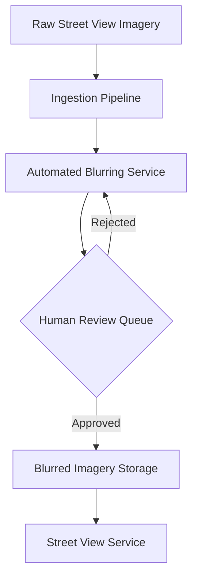

# Visual Search System Design

## Problem Statement

**Interviewer Question:** Can you describe the problem a Visual Search System aims to solve?

**Candidate Answer:** A Visual Search System is designed to help users discover images that are visually similar to a given query image. For instance, if a user uploads a picture of a specific type of furniture, the system should return other images of similar furniture. The core challenge is to effectively identify and retrieve relevant images from a vast database based purely on visual characteristics, without relying on textual metadata. The system should also support searching based on a cropped portion of an image and present results ranked by visual similarity.

## Identify Metrics

**Interviewer Question:** What metrics would you use to evaluate the performance and success of a Visual Search System?

**Candidate Answer:** Evaluating a visual search system requires both offline and online metrics.

**Offline Metrics (Model Evaluation):**

*   **Recall@k:** This measures the proportion of relevant items (similar images) that are retrieved within the top `k` results. It's crucial for ensuring that the system doesn't miss highly similar items. For example, if there are 10 truly similar images and the system returns 7 of them in the top 100, Recall@100 would be 0.7.
*   **Precision@k:** This measures the proportion of retrieved items within the top `k` results that are actually relevant. High precision means fewer irrelevant results are shown. For example, if the system returns 100 images and 80 are truly similar, Precision@100 would be 0.8.
*   **Mean Average Precision (MAP):** A popular metric for ranking problems, MAP considers both precision and recall across different recall levels. It's the mean of the average precision scores for each query.
*   **Normalized Discounted Cumulative Gain (NDCG):** This metric evaluates the ranking quality, considering the position of relevant items. Highly relevant items ranked higher contribute more to the score.
*   **Embedding Space Metrics:** Metrics like **intra-class distance** (distance between embeddings of similar images) and **inter-class distance** (distance between embeddings of dissimilar images) can be used to evaluate the quality of the learned embeddings. Ideally, intra-class distances should be small, and inter-class distances should be large.

**Online Metrics (System Performance & User Experience):**

*   **Click-Through Rate (CTR):** The percentage of times users click on a recommended image after a search. A higher CTR indicates better relevance.
*   **Engagement Rate:** Measures user interactions beyond clicks, such as saves, shares, or time spent viewing results.
*   **Latency:** The time taken for the system to return search results. As specified, this should be very low (e.g., less than 200ms).
*   **User Satisfaction:** Can be measured through A/B testing, surveys, or implicit feedback signals.

## Train and Evaluate Model

**Interviewer Question:** How would you approach training and evaluating the machine learning model for visual search, from data preparation to model selection?

**Candidate Answer:** The core of a visual search system is **representation learning**, where images are transformed into numerical vectors called embeddings. Similar images should have embeddings that are close to each other in a high-dimensional space.

### Data Preparation

1.  **Data Collection:** Gather a large dataset of images. This includes user-uploaded images and potentially publicly available image datasets. Crucially, we need labels indicating visual similarity. This can be derived from user interactions (e.g., users clicking on similar images, saving them together) or manual annotation.
2.  **Data Engineering:**
    *   **Image Data:** Store images with metadata such as `ID`, `Owner ID`, `Upload time`, and `Manual tags`. An example schema is provided in Table 1.

        | ID | Owner ID | Upload time | Manual tags |
        |---|---|---|---|
        | 1 | 8 | 1658451341 | Zebra |
        | 2 | 5 | 1658451841 | Pasta, Food, Kitchen |
        | 3 | 19 | 1658821820 | Children, Family, Party |
        *Table 1: Image Data Schema*

    *   **User Data:** Store user demographic attributes like `ID`, `Username`, `Age`, `Gender`, `City`, `Country`, `Email`. An example schema is provided in Table 2.

        | ID | Username | Age | Gender | City | Country | Email |
        |---|---|---|---|---|---|---|
        | 1 | johnduo | 26 | M | San Jose | USA | john@gmail.com |
        | 2 | hs2008 | 49 | M | Paris | France | hsieh@gmail.com |
        | 3 | alexish | 16 | F | Rio | Brazil | alexh@yahoo.com |
        *Table 2: User Data Schema*

    *   **User-Image Interactions:** Record user interactions such as impressions and clicks, including `User ID`, `Query image ID`, `Displayed image ID`, `Position in the displayed list`, `Interaction type`, `Location`, and `Timestamp`. This data is vital for generating implicit feedback and creating training labels for similarity. An example schema is provided in Table 3.

        | User ID | Query image ID | Displayed image ID | Position in the displayed list | Interaction type | Location (lat, long) | Timestamp |
        |---|---|---|---|---|---|---|
        | 8 | 2 | 6 | 1 | Click | 38.8951 -77.0364 | 1658450539 |
        | 6 | 3 | 9 | 2 | Click | 38.8951 -77.0364 | 1658451341 |
        | 91 | 5 | 1 | 2 | Impression | 41.9241 -89.0389 | 1658451365 |
        *Table 3: User-Image Interaction Data Schema*

3.  **Feature Engineering (Image Preprocessing):**
    *   **Resizing:** All images must be resized to a fixed dimension (e.g., 224x224 pixels) to serve as input for convolutional neural networks (CNNs).
    *   **Scaling:** Pixel values are typically scaled to a range like [0, 1] by dividing by 255.
    *   **Normalization:** Z-score normalization (mean 0, standard deviation 1) can further standardize pixel values, which often helps model convergence.
    *   **Data Augmentation:** Techniques like random cropping, rotation, flipping, and color jittering can be applied to increase the diversity of the training data and improve model generalization.

### Model Training

1.  **Model Architecture:** A common approach is to use a deep Convolutional Neural Network (CNN) as an encoder to generate image embeddings. Pre-trained models like ResNet, Inception, or EfficientNet are excellent starting points due to their strong feature extraction capabilities from large datasets like ImageNet.
2.  **Loss Function:**
    *   **Triplet Loss:** This is a widely used loss function for learning embeddings. It aims to ensure that an anchor image's embedding is closer to a positive sample's embedding (visually similar) than to a negative sample's embedding (visually dissimilar) by a certain margin. The loss is defined as: `L = max(0, d(a, p) - d(a, n) + margin)`, where `d` is a distance metric (e.g., Euclidean distance), `a` is the anchor, `p` is the positive, and `n` is the negative sample.
    *   **Contrastive Loss:** Similar to triplet loss, it pulls similar samples closer and pushes dissimilar samples apart.
    *   **ArcFace/CosFace Loss:** These are often used in facial recognition but can be adapted for general visual similarity tasks, focusing on maximizing angular or cosine similarity between embeddings of similar images.
3.  **Training Data Generation (Pairs/Triplets):** For triplet loss, triplets (anchor, positive, negative) need to be generated. Positive pairs can be derived from user interaction data (e.g., images clicked after searching for a query image, or images saved together). Negative pairs can be randomly sampled or, more effectively, hard negative mining can be employed to select negative samples that are visually similar to the anchor but semantically different, forcing the model to learn finer distinctions.
4.  **Optimization:** Use optimizers like Adam or SGD with momentum. Learning rate schedules (e.g., cosine decay, step decay) and regularization techniques (e.g., dropout, weight decay) are important for stable training.

### Model Evaluation

1.  **Offline Evaluation:** After training, evaluate the model on a held-out test set using the offline metrics mentioned above (Recall@k, Precision@k, MAP, NDCG). This helps assess the model's ability to generate good embeddings.
2.  **A/B Testing:** Deploy the new model to a small subset of users and compare its online metrics (CTR, engagement) against the existing system. This is the most reliable way to determine real-world impact.
3.  **Human Evaluation:** For subjective tasks like visual similarity, human evaluators can provide valuable feedback on the quality and relevance of search results.

## Design the System

**Interviewer Question:** Walk me through the high-level and detailed system design for a Visual Search System, including all major components.

**Candidate Answer:** A Visual Search System typically consists of an offline processing pipeline for embedding generation and an online serving pipeline for real-time search.

### High-Level Architecture

At a high level, the system can be divided into two main parts:

1.  **Offline Indexing Pipeline:** This pipeline processes all images in the database, extracts their features using the trained ML model, and stores these features (embeddings) in a searchable index.
2.  **Online Query Pipeline:** When a user submits a query image, this pipeline extracts its features, queries the index for similar embeddings, retrieves the corresponding images, and returns them to the user.

**Architecture Diagram (High-Level):**

### Detailed System Design

Let's break down the components in more detail:

1.  **Image Storage:**
    *   **Raw Image Storage:** A distributed, highly available storage system (e.g., S3, HDFS) to store raw image files. Images are typically stored in their original format and resolution.
    *   **Metadata Database:** A relational database (e.g., PostgreSQL, MySQL) or NoSQL database (e.g., Cassandra) to store image metadata (ID, owner, upload time, tags) and user data.

2.  **Offline Indexing Pipeline:**
    *   **Image Ingestion:** A mechanism (e.g., Kafka, SQS) to handle new image uploads. When a new image is uploaded, it's added to a queue for processing.
    *   **Feature Extraction Service:** A distributed processing system (e.g., Spark, Flink) that reads new images from the queue, preprocesses them (resizing, normalization), and feeds them to the **Image Embedding Model**.
    *   **Image Embedding Model:** The trained deep learning model (CNN) that takes an image as input and outputs its fixed-size embedding vector. This model is typically deployed on GPUs for efficient inference.
    *   **Embedding Storage:** A specialized database for storing high-dimensional vectors. This could be a vector database (e.g., Milvus, Pinecone) or a distributed key-value store (e.g., Cassandra) with custom indexing.
    *   **Approximate Nearest Neighbor (ANN) Index:** For a large number of embeddings (billions), exact nearest neighbor search is too slow. An ANN index (e.g., Faiss, Annoy, HNSW) is built on top of the embeddings to allow for fast, approximate similarity searches. This index is periodically updated or rebuilt as new embeddings are added.

3.  **Online Query Pipeline:**
    *   **API Gateway/Load Balancer:** Handles incoming user requests for visual search.
    *   **Query Preprocessing:** Takes the user's query image (or cropped region), preprocesses it (resizing, normalization) to match the input requirements of the embedding model.
    *   **Query Embedding Service:** Uses the same Image Embedding Model (or a lightweight version) to generate an embedding for the query image. This service needs to be highly optimized for low latency.
    *   **ANN Search Service:** Receives the query embedding and performs a fast lookup in the ANN index to find the `k` most similar image embeddings. This service is critical for search speed.
    *   **Result Retrieval & Ranking:** Retrieves the full image metadata (from the Metadata Database) for the `k` candidate images returned by the ANN search. It then performs a final re-ranking based on exact distance calculations (if ANN was approximate) and potentially other factors (e.g., freshness, popularity, content moderation scores).
    *   **Image Delivery Service:** Serves the actual image files (e.g., from a CDN) to the user's device.

**Architecture Diagram (Detailed):**

## Scale the Design

**Interviewer Question:** How would you ensure this Visual Search System can scale to handle billions of images and millions of users?

**Candidate Answer:** Scaling a visual search system involves optimizing both the offline indexing and online query pipelines.

1.  **Distributed Storage:** Use distributed file systems (HDFS) or object storage (S3) for raw images to handle petabytes of data. Metadata databases should be sharded or use NoSQL solutions like Cassandra for horizontal scalability.
2.  **Distributed Processing for Feature Extraction:** The Feature Extraction Service must be highly parallelized. Technologies like Apache Spark or Flink can process large batches of images across a cluster of machines. GPUs are essential for accelerating the Image Embedding Model inference, and these can be managed in a distributed fashion (e.g., Kubernetes with GPU nodes).
3.  **Scalable Embedding Storage and ANN Index:**
    *   **Vector Databases:** Specialized vector databases (Milvus, Pinecone, Weaviate) are built for storing and querying billions of high-dimensional vectors efficiently. They often handle sharding and indexing automatically.
    *   **Distributed ANN Libraries:** Libraries like Faiss or Annoy can be used to build and query ANN indexes across multiple machines. The index itself can be sharded, with each shard responsible for a subset of the embedding space.
    *   **Hierarchical Indexing:** For extremely large datasets, a multi-level indexing strategy can be employed, where a coarse-grained index quickly narrows down the search space, followed by a finer-grained search within the candidate subset.
4.  **Low-Latency Query Embedding Service:** Deploy the Query Embedding Service on dedicated inference servers with GPUs or specialized AI accelerators (TPUs) to ensure sub-millisecond latency for embedding generation. Model quantization or pruning can reduce model size and improve inference speed.
5.  **Caching:** Implement caching at various levels:
    *   **Query Result Cache:** Cache results for popular or recent queries.
    *   **Embedding Cache:** Cache embeddings of frequently queried images.
    *   **Metadata Cache:** Cache metadata for frequently accessed images.
6.  **Load Balancing and Microservices:** Use load balancers to distribute traffic across multiple instances of each service (API Gateway, Query Embedding Service, ANN Search Service, Result Retrieval). Decouple components into microservices to allow independent scaling and deployment.
7.  **Asynchronous Processing:** For non-critical operations (e.g., updating the ANN index, logging interactions), use message queues to decouple producers and consumers, preventing bottlenecks in the critical path.
8.  **Monitoring and Alerting:** Implement robust monitoring for all system components, including data pipelines, model performance, service latency, and error rates. Set up automated alerts to quickly detect and respond to issues.
9.  **MLOps and A/B Testing:** Establish robust MLOps practices for continuous integration, continuous delivery, and continuous training of models. This ensures that models are always up-to-date with the latest data and can adapt to evolving user behavior and image content. A/B testing is crucial for safely experimenting with new models and features and measuring their impact on key online metrics.

---

# Google Street View Blurring System Design

## Problem Statement

**Interviewer Question:** What is the core problem the Google Street View Blurring System aims to solve, and why is it important?

**Candidate Answer:** The primary problem is to **automatically detect and blur sensitive information**, specifically human faces and vehicle license plates, in vast quantities of imagery collected for services like Google Street View. This is critical for several reasons:

1.  **Privacy Protection:** To protect the privacy of individuals captured in public spaces, preventing their identification without consent.
2.  **Legal Compliance:** To adhere to privacy laws and regulations (e.g., GDPR, CCPA) across various jurisdictions, avoiding legal repercussions and fines.
3.  **Ethical Responsibility:** To maintain public trust and demonstrate responsible data handling practices.
4.  **Scalability:** To process billions of images efficiently and accurately, given the continuous collection of new Street View data.

The system must achieve high accuracy in detection while minimizing false positives (blurring non-sensitive objects) and false negatives (missing sensitive objects).

## Identify Metrics

**Interviewer Question:** What metrics would you use to evaluate the effectiveness and performance of the Google Street View Blurring System?

**Candidate Answer:** Evaluating this system requires a focus on both detection accuracy and operational efficiency.

**Offline Metrics (Model Evaluation):**

*   **Precision:** Out of all detected faces/license plates, what proportion were actually faces/license plates? High precision minimizes false positives (e.g., blurring a billboard that looks like a face).
*   **Recall:** Out of all actual faces/license plates in the images, what proportion were correctly detected? High recall minimizes false negatives (e.g., missing a face or license plate).
*   **F1-Score:** The harmonic mean of precision and recall, providing a balanced measure, especially important when both false positives and false negatives are costly.
*   **Intersection over Union (IoU):** For object detection, IoU measures the overlap between the predicted bounding box and the ground truth bounding box. A higher IoU indicates more accurate localization of the detected object.
*   **Mean Average Precision (mAP):** A common metric for object detection that averages precision values across different recall levels and object classes.

**Online Metrics (System Performance & Operational Efficiency):**

*   **Processing Throughput:** The number of images processed per unit of time (e.g., images per second/hour). Must be high to handle the massive data volume.
*   **Latency:** The time taken to process a single image or a batch of images. While not real-time for users, processing needs to be efficient.
*   **Human Review Queue Size/Backlog:** The number of images flagged for manual review. A well-performing automated system should minimize this.
*   **Cost Efficiency:** The computational resources (CPU, GPU, storage) used per image processed.
*   **Error Rate (Post-Review):** The percentage of images that still contain unblurred sensitive information after both automated processing and human review. This should be extremely low.

## Train and Evaluate Model

**Interviewer Question:** How would you approach training and evaluating the machine learning models for face and license plate blurring, considering the scale and accuracy requirements?

**Candidate Answer:** The core of this system involves **object detection** models, specifically for faces and license plates. Given the high accuracy and scale requirements, deep learning-based approaches are most suitable.

### Data Preparation

1.  **Data Collection:** Collect a massive and diverse dataset of Street View images. This dataset must contain a wide variety of lighting conditions, angles, distances, ethnicities, vehicle types, and geographical locations.
2.  **Data Annotation:** This is a labor-intensive but critical step. Human annotators must meticulously draw bounding boxes around every face and license plate in the collected images. Each bounding box is labeled with its class (e.g., `face`, `license_plate`).
3.  **Data Augmentation:** To increase the robustness and generalization of the models, apply extensive data augmentation techniques:
    *   **Geometric Transformations:** Rotation, scaling, translation, flipping, cropping.
    *   **Photometric Transformations:** Brightness, contrast, saturation, hue adjustments, noise injection.
    *   **Occlusion Simulation:** Randomly occluding parts of faces or license plates to make the model robust to partial visibility.
    *   **Synthetic Data Generation:** Potentially generate synthetic faces and license plates to augment rare cases or improve diversity.

4.  **Data Engineering:**
    *   **Image Preprocessing:** Resize images to a consistent input size for the neural network. Normalize pixel values.
    *   **Feature Store:** While not a traditional feature store for tabular data, a system to manage and version annotated images and their processed features (e.g., bounding box coordinates, class labels) is essential.

### Model Training

1.  **Model Architecture:** State-of-the-art object detection models are ideal. These typically fall into two categories:
    *   **Two-stage detectors:** (e.g., Faster R-CNN, Mask R-CNN) offer higher accuracy but are generally slower.
    *   **One-stage detectors:** (e.g., YOLO, SSD, RetinaNet) are faster but might have slightly lower accuracy. Given the scale, a balance between speed and accuracy is needed, potentially favoring optimized one-stage detectors or highly optimized two-stage detectors.
    *   **Backbone Network:** A powerful pre-trained CNN (e.g., ResNet, EfficientNet) is used as the backbone for feature extraction.
2.  **Loss Function:** Object detection models typically use a combination of loss functions:
    *   **Classification Loss:** (e.g., Focal Loss, Cross-Entropy) for classifying whether a detected object is a face, license plate, or background.
    *   **Localization Loss:** (e.g., Smooth L1 Loss, IoU Loss) for regressing the bounding box coordinates.
3.  **Training Strategy:**
    *   **Transfer Learning:** Initialize the model with weights pre-trained on large datasets like ImageNet to leverage learned features.
    *   **Distributed Training:** Train models on large clusters of GPUs or TPUs using distributed training frameworks (e.g., TensorFlow Distributed, PyTorch Distributed) to handle massive datasets and complex models.
    *   **Hyperparameter Tuning:** Use automated tools (e.g., Google Vizier, Optuna) to find optimal learning rates, batch sizes, and other hyperparameters.

### Model Evaluation

1.  **Offline Evaluation:** Evaluate the trained models on a held-out test set using mAP, Precision, Recall, and F1-Score. Pay close attention to performance across different subsets of data (e.g., low-light images, small faces, partially obscured license plates).
2.  **Human-in-the-Loop Evaluation:** A critical component. A portion of the processed images, especially those with low confidence scores or ambiguous detections, must be sent to human reviewers for verification and correction. This feedback loop is essential for continuous model improvement and ensuring legal compliance.
3.  **A/B Testing:** While not directly A/B testing user experience, different versions of the blurring system can be A/B tested on a subset of new imagery to compare their performance metrics (e.g., human review queue size, false positive/negative rates) before full deployment.

## Design the System

**Interviewer Question:** Outline the high-level and detailed system design for the Google Street View Blurring System, covering its main components.

**Candidate Answer:** The system needs to process vast amounts of imagery, detect sensitive objects, apply blurring, and manage a human review process.

### High-Level Architecture

### Detailed System Design

#### 1. Data Ingestion and Storage

*   **Raw Imagery Storage:** A highly scalable, distributed object storage system (e.g., Google Cloud Storage, S3) to store raw, unblurred Street View images. These are typically very large files.
*   **Metadata Database:** A distributed database (e.g., Spanner, Cassandra) to store metadata about each image (e.g., location, capture time, processing status).
*   **Image Ingestion Service:** Handles the upload of new imagery from Street View cars. It might involve batch processing and streaming data to a message queue (e.g., Kafka, Pub/Sub) for further processing.

#### 2. Automated Blurring Pipeline

*   **Image Preprocessing Service:** Resizes, crops, and normalizes images to prepare them for the object detection models. This service can run on distributed compute (e.g., Dataflow, Spark).
*   **Object Detection Service:** This is the core ML component. It uses the trained deep learning models (faces, license plates) to detect sensitive objects in the preprocessed images. This service runs on GPU-accelerated clusters for high throughput and low latency. It outputs bounding box coordinates and confidence scores for each detected object.
*   **Blurring Application Service:** Takes the original image and the detected bounding boxes. It applies a blurring filter (e.g., Gaussian blur) to the specified regions. This service must be highly optimized for image manipulation.
*   **Confidence Thresholding:** Detections with confidence scores above a certain threshold are automatically blurred. Detections below a lower threshold are discarded. Detections within an ambiguous range are flagged for human review.

#### 3. Human Review and Feedback Loop

*   **Human Review Queue:** A message queue (e.g., SQS, Pub/Sub) and a task management system to route flagged images to human annotators.
*   **Annotation Tool:** A specialized web-based tool for human reviewers to:
    *   Verify automated detections (approve/reject).
    *   Correct bounding boxes.
    *   Annotate missed objects (false negatives).
    *   Mark false positives.
*   **Feedback Loop:** The corrections and new annotations from human reviewers are fed back into the data annotation pipeline to retrain and improve the object detection models. This continuous improvement cycle is vital for maintaining high accuracy.

#### 4. Blurred Imagery Storage and Serving

*   **Blurred Imagery Storage:** A separate, secure distributed object storage for the processed and blurred images. These images are ready for public consumption.
*   **Content Delivery Network (CDN):** Blurred images are served via a CDN to ensure low latency delivery to users worldwide.
*   **Street View Service:** The front-end service that retrieves and displays the blurred images to users.

**Architecture Diagram (Detailed):**

![Google Street View Blurring System High-Level Architecture](https://private-us-east-1.manuscdn.com/sessionFile/Pt6sUv0bvUSkxpEd5sPmaa/sandbox/dHlwAblO8yV65PdDMBmKdR-images_1758096433223_na1fn_L2hvbWUvdWJ1bnR1L2RpYWdyYW1zL2dvb2dsZV9zdHJlZXRfdmlld19ibHVycmluZ19zeXN0ZW1faGlnaF9sZXZlbA.png?Policy=eyJTdGF0ZW1lbnQiOlt7IlJlc291cmNlIjoiaHR0cHM6Ly9wcml2YXRlLXVzLWVhc3QtMS5tYW51c2Nkbi5jb20vc2Vzc2lvbkZpbGUvUHQ2c1V2MGJ2VVNreHBFZDVzUG1hYS9zYW5kYm94L2RIbHdBYmxPOHlWNjVQZERNQm1LZFItaW1hZ2VzXzE3NTgwOTY0MzMyMjNfbmExZm5fTDJodmJXVXZkV0oxYm5SMUwyUnBZV2R5WVcxekwyZHZiMmRzWlY5emRISmxaWFJmZG1sbGQxOWliSFZ5Y21sdVoxOXplWE4wWlcxZmFHbG5hRjlzWlhabGJBLnBuZyIsIkNvbmRpdGlvbiI6eyJEYXRlTGVzc1RoYW4iOnsiQVdTOkVwb2NoVGltZSI6MTc5ODc2MTYwMH19fV19&Key-Pair-Id=K2HSFNDJXOU9YS&Signature=kdd~z-UqboaqBG9dV1UdngziKEylEbA436muwryXBYYWW9m8nhlIsHNGNGpQrCpIVMeWHYpanIlY5j1bTc7pw2x6aOgZv33ml1Lnfj8PCGlCGBS0e6f6OeBcILSaaWL6PSdOs2Mmn3hTpdWW9vsy48l-IR4bswsjfS8n0PAX1ijuz4vh4uVY0-b9UFpP6Lj8uOjY04xC1ezsGHk1TLhdSVyYoheV1GDpRGqninUXr4JmeOtNeAQLH4NKZ~lLAhB2Fc6xFgdP5BMybSNTaGCSSXsBTussWLjoWRodI0i4X5UjisOo-p9lys52DUEq1VpxJsGJl0UHy8AwnkJApdY~nQ__)

![Google Street View Blurring System Detailed Architecture](https://private-us-east-1.manuscdn.com/sessionFile/Pt6sUv0bvUSkxpEd5sPmaa/sandbox/dHlwAblO8yV65PdDMBmKdR-images_1758096433223_na1fn_L2hvbWUvdWJ1bnR1L2RpYWdyYW1zL2dvb2dsZV9zdHJlZXRfdmlld19ibHVycmluZ19zeXN0ZW1fZGV0YWlsZWQ.png?Policy=eyJTdGF0ZW1lbnQiOlt7IlJlc291cmNlIjoiaHR0cHM6Ly9wcml2YXRlLXVzLWVhc3QtMS5tYW51c2Nkbi5jb20vc2Vzc2lvbkZpbGUvUHQ2c1V2MGJ2VVNreHBFZDVzUG1hYS9zYW5kYm94L2RIbHdBYmxPOHlWNjVQZERNQm1LZFItaW1hZ2VzXzE3NTgwOTY0MzMyMjNfbmExZm5fTDJodmJXVXZkV0oxYm5SMUwyUnBZV2R5WVcxekwyZHZiMmRzWlY5emRISmxaWFJmZG1sbGQxOWliSFZ5Y21sdVoxOXplWE4wWlcxZlpHVjBZV2xzWldRLnBuZyIsIkNvbmRpdGlvbiI6eyJEYXRlTGVzc1RoYW4iOnsiQVdTOkVwb2NoVGltZSI6MTc5ODc2MTYwMH19fV19&Key-Pair-Id=K2HSFNDJXOU9YS&Signature=EL1ypkQzobfG7jefosNwIFT69DseUtxkhfopzx9ns~Zg0LMtR0IQg3JLjQGatqLIX9PZapnZOTv8e-lxynFolHmdkKYhM4kr31rVvxn~lR6DQmpkJfRWQa~UXbRFH~P9KvVFAlXRs0oTxNMjb93NnXnbCxn~DyzAJm8Wf2GqILaUX4sFFGJlaEvgI3CrBPdmpn9PKTMhmFDZ7mTqOlRujuu3xH566GZRH1qAr9DMLmaWrhp5lXSGol1KJqwE-Kl0v7c0j~MooDZsoH52lA0VOybOIqpTeKGjxTRJ0wVGTge9HAPrXOfKet412efZcw~c1LPQ8cBiIxnCOtWPUtPPUw__)

## Scale the Design

**Interviewer Question:** How would you ensure this Google Street View Blurring System can scale to process billions of images efficiently and maintain high accuracy globally?

**Candidate Answer:** Scaling the Street View Blurring System requires a combination of distributed processing, optimized ML inference, and robust operational practices.

1.  **Distributed Data Ingestion and Storage:**
    *   **Object Storage:** Utilize highly scalable and geographically distributed object storage (e.g., Google Cloud Storage, AWS S3) for raw and blurred imagery. This handles petabytes of data.
    *   **Message Queues:** Use high-throughput distributed message queues (e.g., Kafka, Pub/Sub) to decouple ingestion from processing, allowing services to scale independently.
2.  **Massively Parallel Processing:**
    *   **Distributed Compute Frameworks:** Leverage frameworks like Apache Spark, Apache Flink, or Google Cloud Dataflow for image preprocessing and batch processing. These frameworks can distribute tasks across thousands of machines.
    *   **GPU Clusters:** The Object Detection Service must run on large clusters of GPUs or TPUs. These are essential for accelerating deep learning inference. Orchestration tools like Kubernetes can manage these clusters efficiently.
3.  **Optimized ML Models:**
    *   **Model Quantization/Pruning:** Reduce the size and computational requirements of the object detection models without significant loss of accuracy, enabling faster inference.
    *   **Efficient Architectures:** Choose object detection models known for their balance of speed and accuracy (e.g., YOLOv5, EfficientDet).
    *   **Batch Inference:** Process images in batches on GPUs to maximize throughput.
4.  **Human-in-the-Loop Scalability:**
    *   **Smart Prioritization:** Use ML models to prioritize images for human review based on confidence scores, ambiguity, or potential impact (e.g., images from sensitive locations).
    *   **Crowdsourcing/Distributed Workforce:** Utilize a global workforce for human annotation and review, managed by a robust task distribution system.
    *   **Active Learning:** Continuously retrain models using the most informative samples from human corrections, reducing the need for manual review over time.
5.  **Fault Tolerance and High Availability:**
    *   **Redundancy:** All critical services and data stores should be replicated across multiple availability zones and regions.
    *   **Idempotent Operations:** Ensure that processing steps are idempotent, meaning they can be safely retried without causing unintended side effects.
    *   **Circuit Breakers/Retries:** Implement robust error handling and retry mechanisms between services.
6.  **Monitoring and Alerting:** Implement comprehensive monitoring for all system components, including processing throughput, latency, GPU utilization, human review queue size, and error rates. Set up automated alerts to quickly detect and respond to issues.
7.  **MLOps:** Establish robust MLOps practices for continuous integration, continuous delivery, and continuous training of models. This ensures that models are always up-to-date and perform optimally on new data.

By combining these strategies, the Google Street View Blurring System can effectively handle the immense scale and stringent accuracy requirements of processing global imagery while protecting user privacy.

---

# YouTube Video Search System Design

## Problem Statement

**Interviewer Question:** What is the core problem a YouTube Video Search system aims to solve, and what are its key challenges?

**Candidate Answer:** The primary problem is to **retrieve and rank a list of relevant videos from a massive corpus in response to a user's query**. The goal is to provide the most relevant and engaging videos at the top of the search results to maximize user satisfaction and engagement. Key challenges include:

1.  **Massive Scale:** YouTube has billions of videos, and millions of new videos are uploaded daily. The search system must be able to index and search this vast and rapidly growing corpus.
2.  **Multimodal Content:** Videos are multimodal, containing visual, audio, and textual information (titles, descriptions, comments). The search system needs to understand and leverage all these modalities to determine relevance.
3.  **Ambiguous Queries:** User queries are often short, ambiguous, and can have multiple intents. The system must be able to disambiguate queries and understand the user's true intent.
4.  **Real-time Indexing:** New videos and their associated metadata must be indexed and made searchable in near real-time.
5.  **Personalization:** Search results should be personalized to individual users based on their past behavior, preferences, and context.
6.  **Latency:** Search results must be returned very quickly (e.g., under 200ms) to ensure a good user experience.

## Identify Metrics

**Interviewer Question:** What metrics are crucial for evaluating the performance and business impact of a YouTube Video Search system?

**Candidate Answer:** Evaluating a video search system involves a combination of offline metrics for model quality and online metrics for user engagement and business impact.

**Offline Metrics (Model Evaluation):**

*   **Precision@k:** For a given query, what percentage of the top `k` retrieved videos are relevant? High precision means fewer irrelevant results.
*   **Recall@k:** For a given query, what percentage of all truly relevant videos are included in the top `k` results? High recall ensures comprehensive results.
*   **Mean Average Precision (MAP):** A ranking metric that considers both precision and recall, and is sensitive to the order of relevant items.
*   **Normalized Discounted Cumulative Gain (NDCG):** Evaluates the quality of the ranking, giving higher scores to more relevant items that appear higher in the search results.
*   **Embedding Similarity Metrics:** If using embeddings, metrics like cosine similarity or Euclidean distance between embeddings of relevant query-video pairs versus irrelevant pairs can be used to assess the quality of the embedding space.

**Online Metrics (System Performance & Business Impact):**

*   **Click-Through Rate (CTR):** The percentage of search results that users click on. A higher CTR indicates better relevance.
*   **Watch Time:** The total amount of time users spend watching videos found through search. This is a key metric for YouTube, as it indicates user engagement and satisfaction.
*   **Session Length:** The total time a user spends on the platform after a search. Longer sessions indicate a more engaging search experience.
*   **Conversion Rate:** For commercial queries, this could be the percentage of users who take a desired action (e.g., purchase a product, subscribe to a channel).
*   **Zero-Result Rate:** The percentage of queries that return no results. This should be minimized.
*   **Latency:** The time taken to return search results. Must be very low.

## Train and Evaluate Model

**Interviewer Question:** How would you approach the training and evaluation of the machine learning models for YouTube Video Search, considering its multimodal nature and scale?

**Candidate Answer:** A YouTube Video Search system typically uses a multi-stage architecture, with different models at each stage. The core of the system is learning representations (embeddings) for both queries and videos.

### Data Preparation

1.  **Data Collection:** Collect vast amounts of historical data:
    *   **Video Data:** Video ID, title, description, tags, transcript (from speech-to-text), video content (frames), audio content.
    *   **User Data:** User ID, demographics, search history, watch history, subscriptions.
    *   **Query-Video Interaction Logs:** Records of every search query, the videos shown in the results, and the user's interactions (clicks, watch time, likes, shares).

2.  **Data Engineering:**
    *   **Feature Engineering:** This is a critical step for capturing query-video relevance.
        *   **Text Features:** Use TF-IDF or embeddings (e.g., Word2Vec, BERT) for queries, titles, descriptions, and transcripts.
        *   **Visual Features:** Extract visual features from video frames using pre-trained CNNs (e.g., ResNet, Inception).
        *   **Audio Features:** Extract audio features from the audio track using models like VGGish.
        *   **User Features:** Embeddings representing user interests (learned from watch history), demographic features.
        *   **Video Features:** Video popularity (views, likes), channel popularity, video freshness.
    *   **Feature Store:** A centralized Feature Store is essential for consistent feature definition and low-latency retrieval during both training and inference.
    *   **Labeling:** For a given `(query, video)` pair, the label can be binary (clicked/not clicked) or continuous (watch time). Watch time is often a better signal of user satisfaction.

### Model Training

1.  **Candidate Generation Model:** The goal is to quickly narrow down billions of videos to a few hundred or thousand relevant candidates for a given query. A common approach is a **Two-Tower Model**:
    *   **Query Tower:** A neural network that takes the user's query and user features as input and outputs a query embedding.
    *   **Video Tower:** A neural network that takes video features (text, visual, audio) as input and outputs a video embedding.
    *   **Training:** The model is trained to maximize the dot product (or cosine similarity) of embeddings for `(query, clicked_video)` pairs and minimize it for `(query, not_clicked_video)` pairs. This is often done using a contrastive loss or a softmax loss over a batch of negative samples.

2.  **Ranking Model:** This model takes the candidates generated from the previous stage and ranks them by predicted relevance. This stage uses a richer set of features and a more complex model.
    *   **Model Architecture:** Gradient Boosted Machines (GBMs) like XGBoost or LightGBM are very popular. Deep Neural Networks (DNNs) are also used, especially for learning complex non-linear interactions between query, video, and user features.
    *   **Loss Function:** If predicting clicks, Binary Cross-Entropy is used. If predicting watch time, a regression loss like Mean Squared Error (MSE) is used. Often, a multi-objective loss is used to optimize for both clicks and watch time.

### Model Evaluation

1.  **Offline Evaluation:** Evaluate the trained models on a held-out test set using the offline metrics (Precision@k, Recall@k, MAP, NDCG). For the ranking model, metrics like AUC-ROC (for clicks) or MSE (for watch time) are also used.
2.  **A/B Testing:** This is the gold standard for validating new models. Deploy the new search system to a small, randomized group of users and compare its online metrics (CTR, Watch Time, Session Length) against the existing system.

## Design the System

**Interviewer Question:** Walk me through the high-level and detailed system design for a YouTube Video Search system.

**Candidate Answer:** A YouTube Video Search system requires a robust, scalable, and low-latency architecture with separate pipelines for offline processing and online serving.

### High-Level Architecture

### Detailed System Design

#### 1. Data Ingestion and Storage

*   **Video Ingestion Service:** Handles new video uploads, stores raw video files in distributed storage (e.g., Google Cloud Storage), and extracts metadata (title, description). It also triggers downstream processing like thumbnail generation and speech-to-text transcription.
*   **Metadata Database:** A distributed database (e.g., Spanner, Bigtable) to store video metadata, user profiles, and channel information.
*   **User Interaction Logging:** All user actions (searches, clicks, watch time, likes) are logged and streamed to a real-time message queue (e.g., Kafka, Pub/Sub) for both real-time and batch processing.

#### 2. Offline Processing Pipeline

*   **Feature Extraction Service:** A distributed processing framework (e.g., Spark, Dataflow) that processes raw video data and user logs to generate features:
    *   **Text Embeddings:** For titles, descriptions, transcripts.
    *   **Visual Embeddings:** From video frames.
    *   **Audio Embeddings:** From audio tracks.
    *   **User Embeddings:** From watch history.
    *   **Aggregated Statistics:** Video popularity, channel reputation.
    These features are stored in a **Feature Store**.
*   **Model Training Service:** Uses a distributed ML framework (e.g., TensorFlow, PyTorch) to train the candidate generation and ranking models. Trained models are versioned and stored in a **Model Registry**.
*   **Video Embedding Index Builder:** Periodically builds and updates an Approximate Nearest Neighbor (ANN) index (e.g., Faiss, ScaNN) on the video embeddings for fast candidate generation.

#### 3. Online Serving Pipeline

*   **API Gateway/Load Balancer:** Handles incoming user search requests.
*   **Query Understanding Service:** Processes the user's query to correct spelling, expand synonyms, and identify named entities. It also generates a query embedding using the query tower of the candidate generation model.
*   **Candidate Generation Service:** Uses the query embedding to perform an ANN search on the video embedding index to retrieve a few hundred to a few thousand candidate videos.
*   **Feature Retrieval Service:** Fetches the latest features for the user and the candidate videos from the Feature Store.
*   **Ranking Service:** The trained ranking model is deployed as a low-latency inference service. It takes the user, query, and video features and predicts a relevance score (e.g., a combination of click probability and expected watch time) for each candidate video.
*   **Re-ranking and Filtering Service:** Applies business rules (e.g., filter out blocked content, ensure diversity, apply freshness boosts) and re-ranks the videos before sending the final list to the user.

**Architecture Diagram (Detailed):**

## Scale the Design

**Interviewer Question:** How would you ensure this YouTube Video Search system can scale to handle billions of videos and millions of concurrent users with low latency?

**Candidate Answer:** Scaling a video search system of this magnitude requires a combination of distributed systems, optimized ML, and robust infrastructure.

1.  **Distributed Data Storage and Processing:**
    *   **Video Storage:** Use a globally distributed object storage system for raw video files.
    *   **Databases:** Use sharded and replicated databases for metadata to handle high read/write throughput.
    *   **Data Processing:** Leverage distributed processing frameworks (e.g., Spark, Dataflow) for all offline tasks, allowing horizontal scaling across large clusters.
2.  **Scalable Candidate Generation:**
    *   **Distributed ANN Index:** The ANN index must be sharded and replicated across multiple machines to handle the massive number of video embeddings and high query load.
    *   **Hardware Acceleration:** Use GPUs or TPUs for both query embedding generation and ANN search to reduce latency.
3.  **Low-Latency Ranking:**
    *   **Optimized Models:** Use techniques like model quantization and pruning to reduce the size and inference time of the ranking model.
    *   **Hardware Acceleration:** Deploy the ranking service on GPU/TPU clusters.
    *   **Feature Caching:** Cache frequently accessed user and video features in a low-latency key-value store (e.g., Redis, Memcached).
4.  **Microservices and Auto-Scaling:** Decompose the system into independent microservices. Each service can be auto-scaled based on its specific load.
5.  **Geographical Distribution:** Deploy the entire serving pipeline across multiple geographical regions to reduce latency for users worldwide and provide disaster recovery.
6.  **Robust Monitoring and Alerting:** Implement comprehensive monitoring for all system components, including data pipelines, model performance, service latency, and error rates. Set up automated alerts to quickly detect and respond to issues.
7.  **MLOps:** Establish robust MLOps practices for continuous integration, continuous delivery, and continuous training of models. This ensures that models are always up-to-date with the latest data and can adapt to evolving user behavior and content trends.

By combining these strategies, a YouTube Video Search system can effectively handle massive scale, provide highly relevant and personalized results, and maintain a responsive user experience.

---

# Harmful Content Detection System Design

## Problem Statement

**Interviewer Question:** What is the core problem a Harmful Content Detection system aims to solve, and what are its key challenges?

**Candidate Answer:** The primary problem is to **automatically identify and take action on content that violates a platform's policies**, such as hate speech, violence, misinformation, spam, and adult content. The goal is to create a safe and trustworthy environment for users while minimizing the impact on legitimate content. Key challenges include:

1.  **Subjectivity and Nuance:** What constitutes harmful content can be subjective, context-dependent, and culturally specific. Sarcasm, satire, and re-appropriated terms make it difficult for automated systems to understand the true intent.
2.  **Adversarial Attacks:** Bad actors constantly evolve their tactics to evade detection, using techniques like using subtle misspellings, embedding text in images, or using coded language.
3.  **Multimodality:** Harmful content can appear in various forms, including text, images, videos, and audio. The system must be ableto analyze and understand all these modalities.
4.  **Scale and Real-time Requirements:** Social platforms process billions of pieces of content daily. The detection system must operate at a massive scale and in near real-time to prevent harmful content from spreading.
5.  **High Precision and Recall:** The system must have high precision to avoid incorrectly flagging legitimate content (false positives), which can lead to user frustration and censorship accusations. It must also have high recall to effectively remove harmful content (false negatives).

## Identify Metrics

**Interviewer Question:** What metrics are crucial for evaluating the performance and business impact of a Harmful Content Detection system?

**Candidate Answer:** Evaluating a harmful content detection system requires a focus on accuracy, efficiency, and user impact.

**Offline Metrics (Model Evaluation):**

*   **Precision:** The proportion of content flagged as harmful that is actually harmful. High precision is critical to minimize false positives and avoid censoring legitimate content.
*   **Recall:** The proportion of all harmful content that is correctly identified. High recall is essential for effectively removing harmful material.
*   **F1-Score:** The harmonic mean of precision and recall, providing a balanced measure.
*   **Confusion Matrix:** A table that visualizes the performance of a classification model, showing the number of true positives, true negatives, false positives, and false negatives.
*   **AUC-ROC:** Measures the model's ability to distinguish between harmful and non-harmful content across different probability thresholds.

**Online Metrics (System Performance & User Impact):**

*   **Prevalence of Harmful Content:** The proportion of content viewed by users that is harmful. This is a key metric for measuring the overall effectiveness of the system.
*   **Time-to-Action:** The time taken from when harmful content is posted to when it is actioned (e.g., removed, down-ranked). This should be minimized to reduce the content's reach.
*   **Human Review Queue Size:** The number of items flagged for manual review. A well-performing automated system should reduce the burden on human moderators.
*   **Appeal Rate:** The percentage of users who appeal a decision made by the system. A high appeal rate may indicate a high false positive rate.
*   **User-Reported False Negative Rate:** The percentage of harmful content that is missed by the automated system and subsequently reported by users.

## Train and Evaluate Model

**Interviewer Question:** How would you approach the training and evaluation of the machine learning models for Harmful Content Detection, considering its multimodal and adversarial nature?

**Candidate Answer:** A harmful content detection system requires a multi-layered, multimodal approach to effectively identify and action a wide range of policy-violating content.

### Data Preparation

1.  **Data Collection:** Collect a massive and diverse dataset of content, including text, images, and videos. This data should be sourced from the platform itself and should include both benign and harmful examples.
2.  **Data Annotation:** This is a highly sensitive and critical step. Trained human annotators must review and label content according to a detailed and constantly updated set of policies. Each piece of content is labeled with one or more violation types (e.g., `hate_speech`, `violence`, `spam`).
3.  **Data Augmentation:** To improve model robustness and handle adversarial attacks, apply data augmentation techniques:
    *   **Text:** Synonym replacement, back-translation, character-level perturbations (e.g., adding typos, using special characters).
    *   **Images/Videos:** Geometric and photometric transformations, adding noise, simulating occlusions.
    *   **Synthetic Data Generation:** Generate synthetic examples of harmful content, especially for rare or emerging violation types.

### Model Training

Given the multimodal nature of the problem, a multi-stage, multi-model approach is necessary.

1.  **Text Models:**
    *   **Architecture:** Transformer-based models like BERT, RoBERTa, or specialized models for toxic content detection are used to analyze text from posts, comments, and user profiles.
    *   **Training:** Fine-tune pre-trained language models on the annotated text data. Techniques like multi-task learning can be used to train a single model to detect multiple types of violations.

2.  **Image/Video Models:**
    *   **Architecture:** CNNs (e.g., ResNet, EfficientNet) for image classification and object detection. For videos, models that can process temporal information (e.g., 3D CNNs, LSTMs with CNN features) are used.
    *   **Training:** Train models to detect specific types of harmful visual content, such as graphic violence, nudity, or symbols associated with hate groups.

3.  **Multimodal Models:**
    *   **Architecture:** Combine text, image, and audio features using a multimodal fusion model (e.g., late fusion, early fusion, or cross-modal attention). This allows the system to understand the context of the content as a whole (e.g., text in an image, a meme).
    *   **Training:** Train the multimodal model to predict the likelihood of a piece of content being harmful based on the combined features.

4.  **User and Content Graph Models:**
    *   **Architecture:** Graph Neural Networks (GNNs) can be used to model the relationships between users and content. This can help identify coordinated inauthentic behavior, spam networks, and users who frequently post harmful content.
    *   **Training:** Train the GNN to predict the likelihood of a user or piece of content being part of a malicious network.

### Model Evaluation

1.  **Offline Evaluation:** Evaluate the trained models on a held-out test set using the offline metrics (Precision, Recall, F1-Score, AUC-ROC). It's crucial to evaluate performance on different slices of data (e.g., different languages, regions, violation types) to identify any biases or weaknesses.
2.  **Human-in-the-Loop Evaluation:** A critical component. A portion of the content, especially items with low confidence scores or new types of content, is sent to human reviewers for verification. This feedback loop is essential for continuous model improvement.
3.  **A/B Testing:** Deploy new models to a small subset of users and compare their online metrics (Prevalence of Harmful Content, Time-to-Action, Human Review Queue Size) against the existing system.

## Design the System

**Interviewer Question:** Walk me through the high-level and detailed system design for a Harmful Content Detection system.

**Candidate Answer:** A Harmful Content Detection system is a complex, multi-stage pipeline that operates in near real-time to identify and action policy-violating content.

### High-Level Architecture

### Detailed System Design

#### 1. Content Ingestion and Pre-processing

*   **Content Ingestion Service:** Handles new content uploads (posts, comments, images, videos) and streams them to a real-time message queue (e.g., Kafka).
*   **Pre-processing Service:** Extracts different modalities from the content:
    *   **Text:** Extracts text from posts, comments, and user profiles.
    *   **Images/Videos:** Extracts frames from videos, generates thumbnails.
    *   **Audio:** Extracts audio tracks from videos and transcribes them to text using a speech-to-text model.

#### 2. Detection and Scoring Pipeline

This is a multi-stage pipeline that uses a cascade of models to efficiently and accurately detect harmful content.

*   **Stage 1: Lightweight Classifiers:** A set of simple, fast classifiers (e.g., logistic regression with TF-IDF features, simple CNNs) are used to quickly filter out obviously benign content. This reduces the load on the more complex models in the next stage.
*   **Stage 2: Deep Learning Models:** Content that passes the first stage is sent to a set of more powerful deep learning models:
    *   **Text Models (BERT, etc.)**
    *   **Image/Video Models (ResNet, 3D CNNs, etc.)**
    *   **Audio Models (VGGish, etc.)**
    Each model outputs a score indicating the likelihood of a specific type of violation.
*   **Stage 3: Multimodal Fusion and Graph Models:** The scores and features from the previous stage are fed into a multimodal fusion model and a GNN. These models consider the content as a whole and its relationship to other users and content to generate a final set of harm scores.

#### 3. Decision and Action Engine

*   **Decision Engine:** Takes the harm scores from the detection pipeline and applies a set of policy-based rules to make a decision. The rules are often complex and can depend on the type of violation, the user's history, and the context.
*   **Action Engine:** Executes the decision made by the Decision Engine. Actions can include:
    *   **Remove:** Delete the content from the platform.
    *   **Down-rank:** Reduce the visibility of the content in feeds and search results.
    *   **Add Warning Label:** Add a warning label to the content.
    *   **Send to Human Review:** If the system is not confident in its decision, the content is sent to a queue for manual review.

#### 4. Human Review and Feedback Loop

*   **Human Review Platform:** A specialized tool for human moderators to review flagged content, make a final decision, and provide feedback to the system. This feedback is used to retrain and improve the models.

**Architecture Diagram (Detailed):**

## Scale the Design

**Interviewer Question:** How would you ensure this Harmful Content Detection system can scale to handle billions of pieces of content daily with low latency and high accuracy?

**Candidate Answer:** Scaling a harmful content detection system requires a combination of distributed systems, optimized ML, and a robust human-in-the-loop process.

1.  **Distributed and Asynchronous Architecture:**
    *   **Microservices:** Decompose the system into independent, stateless microservices. This allows for independent scaling and fault isolation.
    *   **Message Queues:** Use high-throughput message queues (e.g., Kafka) to decouple the different stages of the pipeline. This allows services to scale independently and provides resilience to failures.
2.  **Optimized ML Inference:**
    *   **Hardware Acceleration:** Deploy all deep learning models on GPU or TPU clusters for fast inference.
    *   **Model Optimization:** Use techniques like model quantization, pruning, and distillation to reduce the size and inference time of the models.
    *   **Batching:** Process content in batches to maximize the throughput of the ML models.
3.  **Cascading Architecture:** The multi-stage, cascading architecture is key to scalability. By using lightweight models to filter out the majority of benign content first, we can reserve the more computationally expensive models for a smaller, more targeted set of content.
4.  **Scalable Data Stores:**
    *   **Feature Store:** A high-performance feature store is essential for serving features at low latency to the online serving pipeline.
    *   **Databases:** Use sharded and replicated databases for storing content metadata and user information.
5.  **Human-in-the-Loop at Scale:**
    *   **Smart Prioritization:** Use ML models to prioritize content for human review based on confidence scores, potential impact, and uncertainty.
    *   **Distributed Workforce:** Utilize a global, distributed workforce of human moderators to provide 24/7 coverage and handle a large volume of reviews.
6.  **Robust Monitoring and Alerting:** Implement comprehensive monitoring for all system components, including data pipelines, model performance, service latency, and error rates. Set up automated alerts to quickly detect and respond to issues.
7.  **MLOps:** Establish robust MLOps practices for continuous integration, continuous delivery, and continuous training of models. This is crucial for keeping the system up-to-date with the latest adversarial tactics and evolving definitions of harm.

By combining these strategies, a Harmful Content Detection system can effectively operate at a massive scale, providing a safer and more trustworthy experience for users.

---

# Video Recommendation System Design

## Problem Statement

**Interviewer Question:** What is the core problem a Video Recommendation System aims to solve, and what are its key challenges?

**Candidate Answer:** The primary problem is to **suggest videos that a user is most likely to watch and enjoy**, from a vast and constantly growing catalog. The goal is to maximize user engagement (e.g., watch time, likes, shares) and satisfaction, which in turn drives platform growth and revenue. Key challenges include:

1.  **Massive Scale:** Platforms like YouTube have billions of videos and millions of users, requiring recommendations to be generated from an enormous dataset.
2.  **Cold Start:** Providing relevant recommendations for new users or newly uploaded videos with little to no interaction history.
3.  **Dynamic User Interests:** User preferences evolve over time, requiring the system to adapt quickly to changes in taste.
4.  **Content Diversity vs. Exploitation:** Balancing the recommendation of popular or known-to-be-liked content (exploitation) with introducing new, diverse content that might broaden user interests (exploration).
5.  **Multimodal Content:** Videos contain visual, audio, and textual information, all of which can contribute to understanding content and user preferences.
6.  **Latency:** Recommendations need to be generated and displayed quickly to maintain a smooth user experience.

## Identify Metrics

**Interviewer Question:** What metrics would you use to evaluate the effectiveness and performance of a Video Recommendation System?

**Candidate Answer:** Evaluating a video recommendation system requires a blend of offline metrics for model performance and online metrics for real-world impact.

**Offline Metrics (Model Evaluation):**

*   **Precision@k:** Out of the top `k` recommended videos, what proportion are actually relevant or watched by the user? High precision minimizes irrelevant suggestions.
*   **Recall@k:** Out of all videos a user would be interested in, what proportion did the system recommend within the top `k`? High recall ensures comprehensive suggestions.
*   **Mean Average Precision (MAP):** A ranking metric that considers both precision and recall, and is sensitive to the order of relevant items.
*   **Normalized Discounted Cumulative Gain (NDCG):** Evaluates the quality of the ranking, giving higher scores to more relevant items that appear higher in the recommendation list.
*   **AUC-ROC:** If the problem is framed as predicting whether a user will click/watch a video, AUC measures the model's ability to distinguish between positive and negative interactions.

**Online Metrics (System Performance & User Experience):**

*   **Watch Time:** The total duration users spend watching recommended videos. This is often the primary optimization metric for video platforms.
*   **Click-Through Rate (CTR):** The percentage of recommended videos that users click on. A higher CTR indicates better initial relevance.
*   **Engagement Rate:** Measures user interactions beyond clicks, such as likes, shares, comments, and subscriptions.
*   **User Retention:** How often users return to the platform. A good recommendation system should improve long-term retention.
*   **Diversity:** How varied are the recommended videos (e.g., across genres, creators, topics)? Overly narrow recommendations can lead to user boredom.
*   **Freshness:** How often are new or recently uploaded videos recommended? Important for dynamic content platforms.
*   **Latency:** Time taken to generate and display recommendations. Should be low (e.g., under 200ms).

## Train and Evaluate Model

**Interviewer Question:** How would you approach training and evaluating the machine learning models for a Video Recommendation System, considering the challenges of scale, cold start, and dynamic user interests?

**Candidate Answer:** Video recommendation systems typically employ a multi-stage approach: **candidate generation** (retrieval) followed by **ranking**.

### Data Preparation

1.  **Data Collection:** Gather comprehensive data from various sources:
    *   **Video Data:** `video ID`, `creator ID`, `upload time`, `title`, `description`, `tags`, `category`, `transcript` (from speech-to-text), `visual features` (from frames), `audio features`.
    *   **User Data:** `user ID`, `demographics`, `watch history`, `search history`, `subscriptions`, `likes/dislikes`.
    *   **User-Video Interaction Logs:** `user ID`, `video ID`, `impression timestamp`, `click timestamp`, `watch duration`, `like/dislike`, `share`.

2.  **Data Engineering:**
    *   **Feature Extraction:** This is a critical phase. Features are extracted for both users and videos.
        *   **Video Features:** Embeddings from titles/descriptions (e.g., Word2Vec, BERT), visual embeddings (from CNNs), audio embeddings (e.g., VGGish), aggregated statistics (views, likes, comments).
        *   **User Features:** Embeddings representing user interests (learned from watch history, search queries), demographic features, activity level.
        *   **Contextual Features:** Time of day, day of week, device type.
        *   **Cross Features:** Interactions between user and video features (e.g., `user_interest_embedding * video_category_embedding`).
    *   **Feature Store:** A centralized Feature Store is crucial for consistent feature definition and low-latency retrieval during both training and inference.
    *   **Labeling:** For candidate generation, labels are typically binary (user watched/clicked video). For ranking, labels can be watch duration or a weighted combination of interactions.

### Model Training

1.  **Candidate Generation Model (Retrieval):** The goal is to efficiently retrieve a few hundred to a few thousand relevant videos from billions. A common approach is a **Two-Tower Model**:
    *   **User Tower:** A neural network that takes user features (e.g., watch history embeddings, demographics) as input and outputs a user embedding.
    *   **Video Tower:** A neural network that takes video features (e.g., title embeddings, category, popularity) as input and outputs a video embedding.
    *   **Training:** The model is trained to maximize the similarity (e.g., dot product, cosine similarity) between user embeddings and embeddings of videos they interacted with positively, and minimize similarity with negative samples. This is often done using a contrastive loss or a softmax loss over a batch of negative samples.
    *   **Cold Start:** For new users, initial recommendations can be based on popular videos, trending videos, or videos similar to those watched by users with similar demographics. For new videos, content-based features are used to generate initial embeddings.

2.  **Ranking Model:** This model takes the candidates generated from the retrieval stage and ranks them by predicted relevance. This stage uses a richer set of features and a more complex model.
    *   **Model Architecture:** Gradient Boosted Machines (GBMs) like XGBoost or LightGBM are very popular due to their performance. Deep Neural Networks (DNNs) are also used, especially for learning complex non-linear interactions between features.
    *   **Loss Function:** Typically optimizes for expected watch time or a weighted combination of various engagement signals (clicks, likes, shares).

### Model Evaluation

1.  **Offline Evaluation:** Evaluate the trained models on a held-out test set using the offline metrics (Precision@k, Recall@k, MAP, NDCG, AUC-ROC). For ranking models, also evaluate metrics like Mean Squared Error (MSE) if optimizing for watch time.
2.  **A/B Testing:** This is the gold standard for validating new models. Deploy the new recommendation system to a small, randomized group of users (treatment group) and compare its online metrics (Watch Time, CTR, Engagement Rate, Retention) against a control group (using the old system). Statistical significance tests are used to determine the impact.

## Design the System

**Interviewer Question:** Outline the high-level and detailed system design for a Video Recommendation System, covering its main components.

**Candidate Answer:** A Video Recommendation System requires robust pipelines for data ingestion, feature engineering, model training, and real-time serving, operating at massive scale.

### High-Level Architecture

### Detailed System Design

#### 1. Data Ingestion and Storage

*   **Video Ingestion Service:** Handles new video uploads, stores raw video files in distributed storage (e.g., S3, GCS), and extracts metadata (title, description). It also triggers downstream processing like thumbnail generation, speech-to-text transcription, and visual/audio feature extraction.
*   **Metadata Database:** A distributed database (e.g., Spanner, Bigtable) to store video metadata, user profiles, and channel information.
*   **User Interaction Logging:** All user actions (views, clicks, watch duration, likes, shares) are logged and streamed to a real-time message queue (e.g., Kafka, Pub/Sub) for both real-time and batch processing.

#### 2. Offline Processing Pipeline (Feature Engineering and Model Training)

*   **Feature Engineering Service:** A distributed processing framework (e.g., Spark, Dataflow) processes raw video data and user logs to generate features:
    *   **Video Embeddings:** From content (text, visual, audio).
    *   **User Embeddings:** From watch history, search queries.
    *   **Aggregated Statistics:** Video popularity, channel reputation.
    These features are stored in a **Feature Store** (e.g., Feast, Tecton) for consistent access during training and online inference.
*   **Model Training Service:** Uses a distributed ML framework (e.g., TensorFlow, PyTorch) to train the candidate generation and ranking models. Trained models are versioned and stored in a **Model Registry**.
*   **Video Embedding Index Builder:** Periodically builds and updates an Approximate Nearest Neighbor (ANN) index (e.g., Faiss, ScaNN) on the video embeddings. This index is crucial for fast candidate generation.

#### 3. Online Serving Pipeline (Real-time Recommendations)

*   **API Gateway/Load Balancer:** Handles incoming user requests for video recommendations.
*   **Candidate Generation Service:**
    *   Takes the current user ID and context.
    *   Generates a user embedding (either in real-time or retrieves from a cache).
    *   Performs an ANN search on the video embedding index to retrieve a few hundred to a few thousand candidate videos that are most similar to the user embedding.
    *   Applies initial filters (e.g., already watched, explicit dislikes).
*   **Feature Retrieval Service:** Fetches the latest features for the user and the candidate videos from the Feature Store.
*   **Scoring Service:** The trained ranking model is deployed as a low-latency inference service (e.g., TensorFlow Serving, NVIDIA Triton). It takes the user, context, and video features and predicts a relevance score (e.g., expected watch time, click probability) for each candidate video.
*   **Re-ranking and Filtering Service:**
    *   Ranks candidate videos based on their predicted scores.
    *   Applies business rules (e.g., diversity, freshness boosts, content moderation filters, sponsored content insertion).
    *   Filters out any videos that violate platform policies or user preferences.
*   **Result Formatting & Delivery:** Formats the final list of recommended videos and delivers it to the user.

**Architecture Diagram (Detailed):**

## Scale the Design

**Interviewer Question:** How would you ensure this Video Recommendation System can scale to handle billions of videos and millions of concurrent users with low latency?

**Candidate Answer:** Scaling a video recommendation system of this magnitude requires a combination of distributed systems, optimized ML, and robust infrastructure.

1.  **Distributed Data Storage and Processing:**
    *   **Video Storage:** Use a globally distributed object storage system for raw video files.
    *   **Databases:** Use sharded and replicated databases (e.g., Cassandra, Bigtable) for metadata to handle high read/write throughput.
    *   **Data Processing:** Leverage distributed processing frameworks (e.g., Spark, Dataflow) for all offline tasks, allowing horizontal scaling across large clusters.
2.  **Scalable Candidate Generation:**
    *   **Distributed ANN Index:** The ANN index must be sharded and replicated across multiple machines to handle the massive number of video embeddings and high query load. Techniques like hierarchical navigable small world (HNSW) graphs can provide efficient approximate nearest neighbor search.
    *   **Hardware Acceleration:** Use GPUs or TPUs for both user embedding generation and ANN search to reduce latency.
3.  **Low-Latency Ranking:**
    *   **Optimized Models:** Use techniques like model quantization and pruning to reduce the size and inference time of the ranking model.
    *   **Hardware Acceleration:** Deploy the ranking service on GPU/TPU clusters.
    *   **Feature Caching:** Cache frequently accessed user and video features in a low-latency key-value store (e.g., Redis, Memcached).
4.  **Microservices and Auto-Scaling:** Decompose the system into independent microservices. Each service can be auto-scaled based on its specific load, ensuring efficient resource utilization and fault isolation.
5.  **Geographical Distribution:** Deploy the entire serving pipeline across multiple geographical regions to reduce latency for users worldwide and provide disaster recovery.
6.  **Robust Monitoring and Alerting:** Implement comprehensive monitoring for all system components, including data pipelines, model performance, service latency, and error rates. Set up automated alerts to quickly detect and respond to issues.
7.  **MLOps:** Establish robust MLOps practices for continuous integration, continuous delivery, and continuous training of models. This ensures that models are always up-to-date with the latest data and can adapt to evolving user behavior and content trends.

By combining these strategies, a Video Recommendation System can effectively handle massive scale, provide highly relevant and personalized results, and maintain a responsive user experience.

---

# Event Recommendation System Design

## Problem Statement

**Interviewer Question:** What is the core problem an Event Recommendation System aims to solve, and why is it distinct from other recommendation systems?

**Candidate Answer:** The primary problem an Event Recommendation System addresses is to **connect users with events they are most likely to be interested in attending**, from a potentially vast and constantly changing pool of available events. This is crucial for platforms that host events (e.g., ticketing sites, social networks) to maximize user engagement, event attendance, and ultimately, sales. It differs significantly from traditional item recommendation systems (like movies or products) due to several unique challenges:

1.  **Sparsity and Cold Start:** Events are often one-time occurrences, leading to sparse user-event interaction data. New events have no historical data, and new users have no interaction history, making traditional collaborative filtering difficult.
2.  **Temporal Dynamics:** Events are highly time-sensitive. Recommendations must consider event dates, times, and proximity to the current date. User interest can also change rapidly.
3.  **Location Dependency:** Events are inherently location-bound. Recommendations must be relevant to the user's geographical location or preferred travel distance.
4.  **Social Influence:** User attendance is often influenced by friends and social connections, which needs to be incorporated into the recommendation logic.
5.  **Diverse Event Types:** Events can range from concerts and sports to workshops and conferences, requiring a system that can handle diverse content features.

The system aims to provide personalized event suggestions that are timely, geographically relevant, and aligned with user preferences and social circles.

## Identify Metrics

**Interviewer Question:** What metrics would you use to evaluate the effectiveness and performance of an Event Recommendation System?

**Candidate Answer:** Evaluating an Event Recommendation System requires a blend of offline metrics for model performance and online metrics for real-world impact.

**Offline Metrics (Model Evaluation - for Binary Classification):**

Since the problem is framed as a binary classification (user interested/not interested in an event), standard classification metrics apply:

*   **Precision:** Out of all events predicted as interested, what proportion were actually interested? High precision minimizes irrelevant recommendations.
*   **Recall:** Out of all events a user was actually interested in, what proportion did the system predict as interested? High recall ensures that relevant events are not missed.
*   **F1-Score:** The harmonic mean of precision and recall, providing a balanced measure.
*   **Area Under the ROC Curve (AUC-ROC):** Measures the model's ability to distinguish between interested and not interested classifications.
*   **Log Loss:** Measures the performance of a classification model where the prediction input is a probability value between 0 and 1.

**Online Metrics (System Performance & User Experience):**

*   **Click-Through Rate (CTR):** Percentage of recommended events that users click on.
*   **Conversion Rate:** Percentage of recommended events that users actually attend or purchase tickets for. This is a strong indicator of business value.
*   **Engagement Rate:** Measures user interactions with recommended events (e.g., adding to calendar, sharing, marking as interested).
*   **Diversity:** How varied are the recommended events? Overly narrow recommendations can lead to user boredom.
*   **Freshness:** How often are new or recently added events recommended? Important for dynamic event landscapes.
*   **Latency:** Time taken to generate and display recommendations. Should be low (e.g., under 200ms).
*   **User Feedback:** Direct feedback from users on recommendation quality.

## Train and Evaluate Model

**Interviewer Question:** How would you approach training and evaluating the machine learning model for an Event Recommendation System, considering its unique challenges?

**Candidate Answer:** Given the unique characteristics of events (temporal, location-dependent, sparse data), a **binary classification approach** is often preferred over traditional collaborative filtering. The problem is framed as: *given a user and an event, predict the probability that the user will be interested in attending that event*.

### Data Preparation

1.  **Data Collection:** Gather comprehensive data from various sources:
    *   **Event Data:** `event ID`, `creator ID`, `start time`, `end time`, `location` (city, state, country, zip, lat/long), `category`, `description` (bag-of-words representation).
    *   **User Data:** `user ID`, `locale`, `birth year`, `gender`, `join timestamp`, `home location`, `timezone`, `past event attendance`.
    *   **Social Data:** `user friend lists`.
    *   **User-Event Interactions:** `invitation status`, `notification timestamp`, `interested/not interested` flags, `actual attendance`.

2.  **Data Engineering:**
    *   **Feature Extraction:** This is a critical phase for event recommendation systems. Features are extracted for each `(user, event)` pair. Missing values are handled (e.g., imputation with zeros for numerical features, forward/backward fill for others).
        *   **Event-based Features:**
            *   **Popularity:** Number of users attending, not attending, maybe attending, invited; ratios of these numbers.
            *   **Content Features:** Embeddings from event descriptions and categories.
            *   **Temporal Features:** `time until event`, `day of week`, `time of day`.
            *   **Location Features:** `distance from user to event`, `event city/country`.
        *   **User-based Features:**
            *   **Historical Preferences:** Embeddings derived from past events the user attended or showed interest in.
            *   **Demographics:** Age, gender, location.
        *   **Social/Friendship Features:**
            *   **Friends' Attendance:** Number of user's friends attending/invited to the event; ratio of attending friends to total friends.
            *   **Host Connection:** Is the event host a friend of the user? How often has the user attended events by this host?
        *   **Cross Features:** Interactions between user and event features (e.g., `user_category_preference * event_category`).

3.  **Labeling:** The target variable is typically `interested` (1) or `not interested` (0) based on explicit user feedback or implicit signals (e.g., attending, adding to calendar).

### Model Training

1.  **Model Architecture:** Given the binary classification nature, models like Gradient Boosted Decision Trees (GBDTs - e.g., XGBoost, LightGBM) or Deep Neural Networks (DNNs) are suitable. DNNs can learn complex non-linear interactions between features.
2.  **Loss Function:** Binary Cross-Entropy is a standard choice for binary classification.
3.  **Addressing Cold Start:**
    *   **New Users:** For new users, recommendations can initially rely on popular events, events in their registered location, or events similar to those attended by users with similar demographics.
    *   **New Events:** For new events, recommendations can be based on content-based features (description, category) and similarity to existing events. As interactions accumulate, the model can incorporate them.
4.  **Training Strategy:** Train the model on historical `(user, event, features, label)` pairs. Due to the temporal nature of events, a time-based split for training and validation is crucial (e.g., train on data up to `T-X` days, validate on `T-X` to `T` days).

### Model Evaluation

1.  **Offline Evaluation:** Evaluate the model on a held-out test set using the offline metrics (Precision, Recall, F1-Score, AUC-ROC, Log Loss). Pay close attention to performance on new users and new events to assess cold-start handling.
2.  **A/B Testing:** Deploy the new model to a small segment of users and compare online metrics (CTR, Conversion Rate, Engagement Rate) against the existing system. This is the most reliable way to measure real-world impact.

## Design the System

**Interviewer Question:** Outline the high-level and detailed system design for an Event Recommendation System, covering its main components.

**Candidate Answer:** An Event Recommendation System requires robust pipelines for data ingestion, feature engineering, model training, and real-time serving.

### High-Level Architecture

### Detailed System Design

#### 1. Data Ingestion and Storage

*   **Event Data Ingestion:** Events are created and updated through an Event Management System. Changes are pushed to a message queue (e.g., Kafka) and stored in a scalable database (e.g., PostgreSQL, Cassandra) and a data lake (e.g., S3, HDFS).
*   **User Data Ingestion:** User profiles and social connections are stored in a user database.
*   **User-Event Interaction Logging:** All user interactions (views, clicks, interests, attendance) are logged and streamed to a message queue for real-time processing and storage in a data lake.

#### 2. Offline Processing Pipeline (Feature Engineering and Model Training)

*   **Feature Engineering Service:** A distributed processing framework (e.g., Spark, Flink) periodically processes raw event, user, and interaction data to generate features for `(user, event)` pairs. This includes temporal, location, social, and content-based features. These features are stored in a **Feature Store** (e.g., Feast, Tecton) for both training and online inference.
*   **Model Training Service:** Uses a distributed ML framework (e.g., TensorFlow, PyTorch) to train the binary classification model. The trained model is versioned and stored in a **Model Registry**.
*   **Candidate Generation (Offline):** For efficiency, a preliminary set of candidate events can be generated offline for each user. This might involve simpler models or rule-based approaches (e.g., events in user's city, events user's friends are attending, popular events).

#### 3. Online Serving Pipeline (Real-time Recommendations)

*   **API Gateway/Load Balancer:** Handles incoming user requests for event recommendations.
*   **Candidate Retrieval Service:** For a given user, this service retrieves a diverse set of candidate events. This can combine pre-computed candidates with real-time candidates based on recent user activity or trending events.
*   **Feature Retrieval Service:** Fetches the latest features for the user and the candidate events from the Feature Store.
*   **Scoring Service:** The trained model from the Model Registry is deployed as a low-latency inference service (e.g., TensorFlow Serving, NVIDIA Triton). It takes the user and event features and predicts the probability of interest for each candidate event.
*   **Ranking and Filtering Service:**
    *   Ranks events based on their predicted probability of interest.
    *   Applies business rules (e.g., filter out past events, events user already attended).
    *   Applies diversity and freshness algorithms to ensure a balanced and up-to-date list.
*   **Result Formatting & Delivery:** Formats the final list of recommended events and delivers it to the user.

**Architecture Diagram (Detailed):**

## Scale the Design

**Interviewer Question:** How would you ensure this Event Recommendation System can scale to handle millions of users, billions of events, and provide real-time recommendations?

**Candidate Answer:** Scaling an Event Recommendation System requires careful consideration of data volume, computational intensity, and latency requirements.

1.  **Distributed Data Processing:** Utilize distributed frameworks like Apache Spark or Flink for all offline data processing tasks, including feature engineering and offline candidate generation. This allows for horizontal scaling across large clusters.
2.  **Scalable Data Stores:**
    *   **Feature Store:** A dedicated feature store (e.g., Feast, Tecton) is crucial for managing and serving features consistently and at low latency for both training and inference. It should support high read/write throughput.
    *   **Event & User Databases:** Use sharded and replicated databases (e.g., Cassandra, DynamoDB, sharded PostgreSQL) to store event and user data, ensuring high availability and scalability.
    *   **Message Queues:** Distributed message queues (e.g., Kafka, Pub/Sub) are essential for handling high-volume event streams and decoupling services, allowing them to scale independently.
3.  **Optimized Model Inference:**
    *   **Hardware Acceleration:** Deploy the Scoring Service on GPU-accelerated servers for faster inference, especially if using DNNs. Use optimized serving frameworks (e.g., TensorFlow Serving, NVIDIA Triton).
    *   **Model Optimization:** Apply techniques like model quantization, pruning, and compilation to reduce model size and improve inference speed.
    *   **Batching:** Batch multiple user requests for inference where possible to maximize hardware utilization.
4.  **Multi-stage Architecture:** The candidate generation and ranking stages are designed to be efficient. Candidate generation quickly narrows down the search space, allowing the more complex ranking model to operate on a smaller, more manageable set of events.
5.  **Pre-computation and Caching:**
    *   **Offline Candidate Generation:** Pre-compute a large pool of candidate events for each user offline and store them in a low-latency key-value store. This significantly reduces the real-time load.
    *   **Caching:** Implement caching at various levels: user features, popular event features, and even final recommendation lists for short periods.
6.  **Microservices and Auto-Scaling:** Decompose the system into independent microservices, each responsible for a specific function (e.g., candidate retrieval, feature retrieval, scoring, ranking). Each microservice can be auto-scaled based on its specific load requirements.
7.  **Geographical Distribution:** Deploy the online serving pipeline across multiple geographical regions. This reduces latency for users globally and provides disaster recovery capabilities.
8.  **Monitoring and Alerting:** Implement comprehensive monitoring for all system components, including data pipelines, model performance, service latency, and error rates. Set up automated alerts to quickly detect and respond to issues.
9.  **MLOps and A/B Testing:** Establish robust MLOps practices for continuous integration, continuous delivery, and continuous training of models. A/B testing is critical for safely experimenting with new models and features and measuring their impact on key online metrics.

---

# Ad Click Prediction on Social Platforms System Design

## Problem Statement

**Interviewer Question:** What is the core problem an Ad Click Prediction system aims to solve on social platforms, and what are its key challenges?

**Candidate Answer:** The primary problem is to **predict the likelihood that a user will click on a given advertisement** presented within a social media feed or other platform interface. The goal is to maximize the efficiency of ad spending for advertisers and improve the user experience by showing more relevant ads. Key challenges include:

1.  **Massive Scale and Low Latency:** Social platforms serve billions of ad impressions daily, requiring predictions to be made in milliseconds to ensure a smooth user experience and participate in real-time bidding auctions.
2.  **Data Sparsity and Imbalance:** Ad clicks are relatively rare events (often <1% CTR), leading to highly imbalanced datasets. Many ads are new, and many users are new, contributing to data sparsity.
3.  **Dynamic User Behavior and Ad Content:** User preferences evolve rapidly, and new ad content is constantly introduced, requiring models to adapt quickly.
4.  **Overspending and User Fatigue:** Repeatedly showing the same ad can lead to budget overspending for advertisers and user fatigue, reducing overall engagement.

## Identify Metrics

**Interviewer Question:** What metrics are crucial for evaluating the performance and business impact of an Ad Click Prediction system?

**Candidate Answer:** Evaluating an Ad Click Prediction system involves both offline metrics for model quality and online metrics for business impact.

**Offline Metrics (Model Evaluation):**

*   **Normalized Cross Entropy (Log Loss):** This is a common metric for binary classification problems, especially with imbalanced datasets. It measures the difference between the predicted probabilities and the actual outcomes. Normalizing it by the background CTR makes it less sensitive to overall click rates.
*   **AUC-ROC (Area Under the Receiver Operating Characteristic Curve):** Measures the model's ability to distinguish between positive (click) and negative (no click) classes across various probability thresholds. It's robust to class imbalance.
*   **Calibration Metrics:** Assess how well the predicted probabilities align with the actual observed click rates. For example, if the model predicts a 5% click probability, then approximately 5% of those ads should actually be clicked. This is crucial for downstream systems like bidding.
*   **Precision and Recall:** While less emphasized than AUC or Log Loss for ranking, they can be useful for specific thresholds or for understanding false positives/negatives.

**Online Metrics (System Performance & Business Impact):**

*   **Revenue Lift:** The most direct business metric, measuring the percentage change in ad revenue attributable to the new prediction system.
*   **Click-Through Rate (CTR):** The percentage of ad impressions that result in a click. While an important indicator, optimizing solely for CTR can lead to clickbait.
*   **Conversion Rate:** The percentage of clicks that lead to a desired action (e.g., purchase, sign-up) on the advertiser's site. This is often a more valuable metric than just CTR.
*   **Return on Ad Spend (ROAS):** Measures the revenue generated for every dollar spent on advertising.
*   **Latency:** The time taken to generate ad predictions. Must be extremely low (e.g., tens of milliseconds) for real-time bidding.
*   **User Engagement Metrics:** Beyond clicks, this includes time spent viewing ads, interactions with ad content, and overall user satisfaction with the ad experience.

## Train and Evaluate Model

**Interviewer Question:** How would you approach the training and evaluation of the machine learning models for ad click prediction, from data preparation to model selection?

**Candidate Answer:** The training and evaluation process for ad click prediction is complex due to the scale, real-time requirements, and data characteristics.

### Data Preparation

1.  **Data Collection:** Collect vast amounts of historical data including:
    *   **User Features:** Demographics, past interactions (clicks, views, purchases), interests, device information.
    *   **Ad Features:** Ad creative (image, video, text), advertiser, bidding price, target audience, historical performance.
    *   **Contextual Features:** Time of day, day of week, platform (mobile/desktop), geographical location.
    *   **Interaction Logs:** Records of every ad impression and whether it resulted in a click.

2.  **Data Engineering:**
    *   **Feature Engineering:** This is critical. Features can include raw values, one-hot encoded categorical features, embeddings for user IDs, ad IDs, creative content, and various cross-features (e.g., `user_age * ad_category`).
    *   **Feature Storage:** Features are stored in a **Feature Store** for consistent access during training and inference. Frequently used features might be cached in low-latency stores like Redis, while others reside in Cassandra or similar distributed databases.
    *   **Labeling:** The label is binary: 1 for a click, 0 for no click. This is derived directly from interaction logs.

3.  **Handling Imbalanced Dataset:** Ad clicks are rare. Strategies include:
    *   **Undersampling:** Randomly remove a portion of the majority class (no-click impressions). This is often preferred over oversampling to avoid creating repetitive features.
    *   **Weighted Loss Functions:** Assign higher weights to the minority class (clicks) in the loss function.
    *   **Negative Sampling:** Carefully select negative samples (non-clicked ads) to be more informative, e.g., by sampling hard negatives.

4.  **Train/Test Split:** A **time-based split** is essential to avoid data leakage. For example, train on data from the past 25 days and validate/test on data from the subsequent 5 days. This simulates real-world deployment where models predict on future data.

### Model Training

Ad click prediction often employs a multi-stage approach:

1.  **Candidate Generation (Pre-ranking):** The goal is to quickly narrow down billions of potential ads to a few hundred or thousand relevant candidates for a given user. This can be done using:
    *   **Two-Tower Model:** A common approach where one neural network tower generates a user embedding and another generates an ad embedding. The model is trained to maximize the dot product (or cosine similarity) of embeddings for `(user, clicked_ad)` pairs. During inference, user embeddings are matched against a pre-computed index of ad embeddings using Approximate Nearest Neighbor (ANN) search.
    *   **Rule-based or Simpler Models:** Can also be used for initial filtering (e.g., show ads from categories the user has interacted with).

2.  **Ranking Model:** This model takes the candidates generated from the previous stage and ranks them by predicted click probability. This stage uses a richer set of features and a more complex model.
    *   **Model Architectures:** Gradient Boosted Machines (GBMs) like XGBoost or LightGBM are very popular due to their performance and interpretability. Deep Neural Networks (DNNs) or Multi-Layer Perceptrons (MLPs) are also used, especially for learning complex non-linear interactions.
    *   **Loss Function:** Typically Binary Cross-Entropy or Log Loss.

### Model Evaluation

1.  **Offline Evaluation:** Evaluate the trained models on the held-out test set using the offline metrics (Normalized Cross Entropy, AUC-ROC, Calibration). Monitor data drift (changes in feature distributions) using metrics like KL divergence.
2.  **A/B Testing:** This is the gold standard for evaluating new models. Deploy the new model to a small, randomized group of users (the treatment group) and compare its online metrics (Revenue Lift, CTR, Conversion Rate) against the control group (using the old model). Use statistical significance tests (e.g., two-sample hypothesis test) to determine if the observed differences are meaningful.

## Design the System

**Interviewer Question:** Walk me through the high-level and detailed system design for an Ad Click Prediction system on a social platform.

**Candidate Answer:** An Ad Click Prediction system operates under extreme latency constraints and massive scale, requiring a multi-stage architecture.

### High-Level Design

### Detailed System Design

#### 1. Ad Request and Initial Filtering

*   **Ad Request Service:** Receives requests from the social platform to fill ad slots for a given user. This service gathers initial user context (e.g., device, location).
*   **Candidate Generation Service:** This is the first stage of filtering. It quickly identifies a few hundred to a few thousand potentially relevant ads from the entire ad inventory. This can involve:
    *   **Two-Tower Model Inference:** User embeddings are generated in real-time or retrieved from a cache. These are then used to query an Approximate Nearest Neighbor (ANN) index of ad embeddings to find similar ads.
    *   **Rule-based Filtering:** Filter out ads based on basic criteria (e.g., already seen, budget exhausted, geo-targeting).
    *   **Simple Models:** Use lightweight models to quickly score and filter out obviously irrelevant ads.

#### 2. Feature Retrieval

*   **Feature Store:** A critical component that stores pre-computed and real-time features for users and ads. It must provide extremely low-latency access. Features can include:
    *   **User Features:** Age, gender, interests, past click history, past purchase history, user embedding.
    *   **Ad Features:** Ad creative ID, advertiser ID, category, historical CTR, ad embedding.
    *   **Contextual Features:** Time of day, device type, operating system.
*   **Feature Engineering Service (Offline):** Continuously updates features in the Feature Store based on new user interactions and ad performance data.

#### 3. Ranking and Prediction

*   **Ranking Service:** This service takes the candidate ads and their rich features from the Feature Store. It then uses the trained heavyweight ranking model to predict the click probability for each candidate ad.
    *   **Model Deployment:** The ranking model is deployed as a high-performance inference service (e.g., TensorFlow Serving, NVIDIA Triton Inference Server) on GPU-accelerated machines.
    *   **Prediction:** For each `(user, ad)` pair, the model outputs a click probability score.

#### 4. Filtering and Re-ranking

*   **Business Logic & Constraints:** Apply final business rules:
    *   **Budget Constraints:** Ensure ads are not shown if the advertiser's budget is exhausted.
    *   **Frequency Capping:** Limit the number of times a user sees the same ad.
    *   **Diversity:** Re-rank ads to ensure a diverse set of ad types or advertisers, preventing user fatigue.
    *   **Ad Quality Filters:** Filter out low-quality or policy-violating ads.
*   **Final Selection:** Select the top `N` ads to display to the user.

#### 5. Ad Display and Logging

*   **Ad Delivery Service:** Renders and delivers the selected ads to the user's device.
*   **Impression and Click Logging:** Crucially, every ad impression and subsequent click (or lack thereof) is logged and sent to a real-time data pipeline (e.g., Kafka). This data feeds back into the Feature Engineering and Offline Training Pipelines.

**Architecture Diagram (Detailed):**

## Scale the Design

**Interviewer Question:** How would you ensure this Ad Click Prediction system can scale to handle billions of ad requests per day with extremely low latency and high accuracy?

**Candidate Answer:** Scaling an Ad Click Prediction system is paramount due to the sheer volume of requests and the real-time nature of ad serving. Several strategies are employed:

1.  **Multi-stage Funnel:** The most critical scaling technique is the multi-stage approach (candidate generation -> ranking -> re-ranking). This allows for rapid initial filtering using less computationally intensive methods, reserving the more complex and accurate models for a smaller, more relevant set of candidates.
2.  **Distributed and Asynchronous Architecture:**
    *   **Microservices:** Decompose the system into independent, stateless microservices (e.g., Candidate Generation, Feature Retrieval, Ranking, Filtering). This allows for independent scaling and fault isolation.
    *   **Message Queues:** Use high-throughput message queues (e.g., Kafka) for logging user interactions and feeding data into offline pipelines. This decouples real-time serving from batch processing.
3.  **Optimized ML Inference:**
    *   **Hardware Acceleration:** Deploy all ML models, especially the ranking model, on GPU or TPU clusters. Use specialized inference servers (e.g., TensorFlow Serving, NVIDIA Triton) that optimize for batching and low-latency serving.
    *   **Model Optimization:** Apply techniques like model quantization, pruning, and distillation to reduce model size and inference time without significant loss of accuracy. This is particularly important for models used in the candidate generation stage.
    *   **Pre-computation:** Pre-compute user and ad embeddings and store them in low-latency key-value stores or ANN indexes.
4.  **Scalable Data Stores:**
    *   **Feature Store:** A high-performance feature store is essential for serving features at low latency. It should support high read throughput and potentially real-time feature updates.
    *   **ANN Index:** Use distributed Approximate Nearest Neighbor (ANN) libraries (e.g., Faiss, HNSW) for efficient similarity search over billions of ad embeddings. These indexes can be sharded and replicated.
    *   **Caching:** Implement aggressive caching at various levels: user features, ad features, and even predicted scores for frequently requested `(user, ad)` pairs.
5.  **Auto-Scaling and Load Balancing:** Implement auto-scaling for all stateless services based on real-time traffic and resource utilization. Use load balancers to distribute requests evenly across instances.
6.  **Geographical Distribution:** Deploy the serving infrastructure across multiple data centers globally to reduce latency for users worldwide and provide disaster recovery capabilities.
7.  **Robust Monitoring and Alerting:** Implement comprehensive monitoring for system health (latency, throughput, error rates) and model performance (online CTR, calibration, data drift). Automated alerts are crucial for proactive issue detection.
8.  **MLOps and A/B Testing:** Establish robust MLOps practices for continuous integration, continuous delivery, and continuous training of models. A/B testing is fundamental for safely experimenting with new models and features and measuring their impact on key online metrics like revenue lift.

---

# Similar Listings on Vacation Rental Platforms System Design

## Problem Statement

**Interviewer Question:** What is the core problem a 

# Similar Listings on Vacation Rental Platforms System Design

## Problem Statement

**Interviewer Question:** What is the core problem a 

Similar Listings on Vacation Rental Platforms system aims to solve, and why is it important for platforms like Airbnb?

**Candidate Answer:** The primary problem is to **identify and recommend listings that are highly similar to a given reference listing** on a vacation rental platform. This is crucial for several reasons:

1.  **Enhanced User Experience:** When a user finds a listing they like but it's unavailable, too expensive, or not quite right, providing similar alternatives significantly improves their experience and keeps them engaged on the platform.
2.  **Increased Conversion:** By offering relevant alternatives, the system helps users find suitable accommodations more quickly, leading to higher booking rates and revenue for the platform.
3.  **Improved Discovery:** It helps users discover listings they might not have found through direct search, especially for niche preferences or when their initial search yields limited results.
4.  **Host Support:** It can help new or less popular listings gain visibility by being recommended as similar to well-known ones.

The system needs to understand various dimensions of similarity, including location, price, amenities, style, and user reviews, and provide these recommendations in real-time.

## Identify Metrics

**Interviewer Question:** What metrics are essential for evaluating the performance and business impact of a Similar Listings system?

**Candidate Answer:** Evaluating a Similar Listings system involves both offline metrics for model quality and online metrics for user engagement and business value.

**Offline Metrics (Model Evaluation):**

*   **Precision@k:** For a given listing, what percentage of the top `k` recommended similar listings are actually considered similar by human evaluators or implicit user feedback? High precision means fewer irrelevant suggestions.
*   **Recall@k:** For a given listing, what percentage of all truly similar listings (from a ground truth set) are included in the top `k` recommendations? High recall ensures comprehensive suggestions.
*   **Mean Average Precision (MAP):** A ranking metric that considers both precision and recall, and is sensitive to the order of relevant items.
*   **Normalized Discounted Cumulative Gain (NDCG):** Evaluates the quality of ranking by giving higher scores to relevant items that appear higher in the recommendation list.
*   **Embedding Similarity Metrics:** If using embeddings, metrics like cosine similarity or Euclidean distance between embeddings of truly similar listings versus dissimilar ones can be used to assess the quality of the embedding space.

**Online Metrics (System Performance & Business Impact):**

*   **Click-Through Rate (CTR) on Similar Listings:** The percentage of users who click on a recommended similar listing.
*   **Conversion Rate (Bookings):** The percentage of users who book a similar listing after viewing the recommendations. This is a direct measure of business impact.
*   **Session Length/Engagement:** Increased time spent on the platform or more interactions with listings after viewing similar recommendations.
*   **User Satisfaction:** Measured through surveys or implicit signals (e.g., repeat visits, positive reviews).
*   **Latency:** The time taken to generate and display similar listings. Must be low (e.g., under 200ms) to ensure a smooth user experience.

## Train and Evaluate Model

**Interviewer Question:** How would you approach the training and evaluation of the machine learning models for identifying similar listings, considering the diverse features involved?

**Candidate Answer:** The core of a similar listings system often relies on learning **listing embeddings** that capture various aspects of a listing's characteristics. These embeddings allow for efficient similarity search.

### Data Preparation

1.  **Data Collection:** Gather comprehensive data for each listing:
    *   **Listing Metadata:** Price, number of bedrooms/bathrooms, property type (apartment, house, villa), amenities (pool, Wi-Fi, kitchen), host information, location (latitude, longitude, city, neighborhood).
    *   **Image Data:** Photos of the listing.
    *   **Textual Data:** Listing title, description, user reviews.
    *   **User Interaction Data:** Views, clicks, bookings, saves, and inquiries for listings. This implicit feedback is crucial for learning user preferences and listing relationships.

2.  **Data Engineering:**
    *   **Feature Engineering:** Create numerical and categorical features from raw data.
        *   **Categorical Features:** One-hot encode property type, amenities, neighborhood.
        *   **Numerical Features:** Normalize price, number of bedrooms.
        *   **Text Features:** Use TF-IDF or embeddings (e.g., Word2Vec, BERT) for titles, descriptions, and reviews.
        *   **Image Features:** Extract visual features using pre-trained Convolutional Neural Networks (CNNs) (e.g., ResNet, VGG) from listing images.
        *   **Interaction Features:** Aggregate user interactions to create features like `listing_popularity`, `host_rating`.
    *   **Feature Store:** Store all processed features in a Feature Store for consistent access during training and inference.

3.  **Creating Training Data (Positive and Negative Pairs):**
    *   **Positive Pairs:** Listings that are genuinely similar. This can be derived from:
        *   **Co-browsing/Co-booking:** Users viewing or booking multiple listings in the same session.
        *   **Human Annotation:** Expert annotators explicitly labeling similar listings.
        *   **Rule-based:** Listings in the same building, with identical amenities, and very close prices.
    *   **Negative Pairs:** Listings that are dissimilar. This is often done through **negative sampling**:
        *   **Random Sampling:** Randomly select listings from a different city or with vastly different characteristics.
        *   **Hard Negative Mining:** Select listings that are *almost* similar but have a key differentiating factor, or listings that the model incorrectly predicted as similar.

### Model Training (Learning Listing Embeddings)

The goal is to learn a low-dimensional embedding vector for each listing such that similar listings have close embeddings and dissimilar listings have distant embeddings.

1.  **Model Architecture:** A common approach is to use a **Siamese Network** or a **Multi-tower Network**.
    *   **Input:** The model takes two listings (a reference listing and a candidate listing) as input, along with their rich features (numerical, categorical, text embeddings, image embeddings).
    *   **Embedding Towers:** Each listing's features are fed into a separate 

tower (e.g., a deep neural network) that outputs a fixed-size embedding vector for that listing.
    *   **Similarity Score:** The similarity between the two listing embeddings is calculated (e.g., using cosine similarity or dot product).
2.  **Loss Function:**
    *   **Contrastive Loss or Triplet Loss:** These losses are designed to pull positive pairs closer together in the embedding space and push negative pairs further apart.
    *   **Binary Cross-Entropy:** If the problem is framed as a binary classification (is this pair similar or not?), then BCE can be used.
3.  **Cold Start for New Listings:**
    *   For new listings without sufficient interaction data, a practical solution is to **average the embeddings of similar existing listings** (e.g., based on location, type, price, and amenities). This provides an initial embedding that can be refined as more user interactions occur.
    *   Content-based features (image, text) can also be used to generate initial embeddings.

### Model Evaluation

1.  **Offline Evaluation:** Evaluate the embedding model on a held-out test set of `(listing, similar_listing)` pairs using metrics like Precision@k, Recall@k, MAP, and NDCG. Also, visually inspect embedding clusters to ensure similar listings are grouped together.
2.  **A/B Testing:** Deploy the new similar listings model to a small segment of users and compare online metrics (CTR, Conversion Rate, Session Length) against the existing system. This is the most reliable way to measure real-world impact.

## Design the System

**Interviewer Question:** Outline the high-level and detailed system design for a Similar Listings system on a vacation rental platform.

**Candidate Answer:** The system needs to efficiently generate and serve similar listing recommendations in real-time from a large inventory.

### High-Level Architecture

### Detailed System Design

#### 1. Data Ingestion and Storage

*   **Listing Database:** Stores all listing metadata (e.g., PostgreSQL, Cassandra).
*   **Image Storage:** Stores listing images (e.g., S3, GCS).
*   **User Interaction Logs:** Streams user views, clicks, and bookings to a message queue (e.g., Kafka) and stores them in a data lake (e.g., HDFS, S3).

#### 2. Offline Embedding Generation Pipeline

This pipeline continuously updates listing embeddings and the similarity index.

*   **Feature Extraction Service:** A distributed processing framework (e.g., Spark, Flink) processes raw listing data, images, and text to extract features. This includes:
    *   **Text Embeddings:** For title, description, reviews.
    *   **Image Embeddings:** From listing photos.
    *   **Categorical/Numerical Features:** Price, amenities, location.
*   **Embedding Model Inference Service:** The trained embedding model (e.g., Siamese Network) is used to generate a fixed-size embedding vector for each listing. This service can run on GPU-accelerated machines.
*   **Embedding Storage:** Stores the high-dimensional listing embeddings in a specialized vector database (e.g., Milvus, Pinecone) or a distributed key-value store.
*   **Approximate Nearest Neighbor (ANN) Index Builder:** Periodically builds and updates an ANN index (e.g., Faiss, Annoy, HNSW) on the listing embeddings. This index enables fast similarity searches.

#### 3. Online Serving Pipeline

This pipeline handles real-time requests for similar listings.

*   **API Gateway/Load Balancer:** Handles incoming user requests for similar listings.
*   **Query Listing ID:** The user provides the ID of the reference listing.
*   **Feature Retrieval Service:** Retrieves the embedding of the query listing from the Embedding Storage.
*   **ANN Search Service:** Uses the query listing's embedding to perform an Approximate Nearest Neighbor search on the ANN index to find `k` most similar listing embeddings.
*   **Result Retrieval & Ranking:**
    *   Retrieves full metadata for the `k` candidate listings from the Listing Database.
    *   Applies business rules (e.g., filter out unavailable listings, apply price range filters, ensure diversity).
    *   Optionally, a re-ranking model (e.g., a lightweight GBDT) can be used to fine-tune the order based on additional real-time features or user context.
*   **Result Formatting & Delivery:** Formats the final list of similar listings (with images, prices, etc.) and delivers it to the user.

**Architecture Diagram (Detailed):**

## Scale the Design

**Interviewer Question:** How would you ensure this Similar Listings system can scale to handle millions of listings and millions of concurrent users with low latency?

**Candidate Answer:** Scaling a Similar Listings system involves optimizing for data volume, computational efficiency, and real-time responsiveness.

1.  **Distributed Data Storage and Processing:**
    *   **Listing Data:** Use sharded and replicated databases (e.g., Cassandra, DynamoDB) for listing metadata to handle high read/write throughput.
    *   **Image Storage:** Utilize distributed object storage (e.g., S3, GCS) for listing images.
    *   **Data Processing:** Leverage distributed processing frameworks (e.g., Spark, Flink) for offline feature extraction and embedding generation, allowing horizontal scaling across large clusters.
2.  **Scalable Embedding Generation and Indexing:**
    *   **GPU/TPU Acceleration:** Deploy the Embedding Model Inference Service on GPU/TPU clusters for rapid embedding generation, especially for image and text features.
    *   **Vector Databases:** Use specialized vector databases (e.g., Milvus, Pinecone, Weaviate) for storing and querying billions of high-dimensional listing embeddings. These are optimized for efficient ANN search and support sharding and replication.
    *   **Distributed ANN Index:** For extremely large indexes, distribute the ANN index across multiple machines. Techniques like sharding the index by geographical region or listing type can improve query performance. The index should be updated incrementally or rebuilt periodically.
3.  **Low-Latency Serving:**
    *   **Caching:** Implement multi-level caching for frequently accessed data:
        *   **Listing Embeddings Cache:** Cache embeddings for popular listings.
        *   **Similar Listing Results Cache:** Cache the results for popular query listings.
    *   **Microservices Architecture:** Decompose the system into independent microservices (e.g., Feature Retrieval, ANN Search, Result Ranking). This allows for independent scaling, deployment, and fault isolation.
    *   **Auto-Scaling:** Use auto-scaling groups to automatically adjust the number of instances for each service based on real-time traffic and resource utilization.
4.  **Geographical Distribution:** Deploy the online serving pipeline across multiple geographical regions to reduce latency for users worldwide and provide disaster recovery capabilities.
5.  **Robust Monitoring and Alerting:** Implement comprehensive monitoring for all system components, including data pipelines, model performance, service latency, and error rates. Set up automated alerts to quickly detect and respond to issues.
6.  **MLOps and A/B Testing:** Establish robust MLOps practices for continuous integration, continuous delivery, and continuous training of models. A/B testing is critical for safely experimenting with new models and features and measuring their impact on key online metrics.

---

# Similar Listings on Vacation Rental Platforms System Design

## Problem Statement

**Interviewer Question:** What is the core problem a Similar Listings on Vacation Rental Platforms system aims to solve, and why is it important for platforms like Airbnb?

**Candidate Answer:** The primary problem is to **identify and recommend listings that are highly similar to a given reference listing** on a vacation rental platform. This is crucial for several reasons:

1.  **Enhanced User Experience:** When a user finds a listing they like but it's unavailable, too expensive, or not quite right, providing similar alternatives significantly improves their experience and keeps them engaged on the platform.
2.  **Increased Conversion:** By offering relevant alternatives, the system helps users find suitable accommodations more quickly, leading to higher booking rates and revenue for the platform.
3.  **Improved Discovery:** It helps users discover listings they might not have found through direct search, especially for niche preferences or when their initial search yields limited results.
4.  **Host Support:** It can help new or less popular listings gain visibility by being recommended as similar to well-known ones.

The system needs to understand various dimensions of similarity, including location, price, amenities, style, and user reviews, and provide these recommendations in real-time.

## Identify Metrics

**Interviewer Question:** What metrics are essential for evaluating the performance and business impact of a Similar Listings system?

**Candidate Answer:** Evaluating a Similar Listings system involves both offline metrics for model quality and online metrics for user engagement and business value.

**Offline Metrics (Model Evaluation):**

*   **Precision@k:** For a given listing, what percentage of the top `k` recommended similar listings are actually considered similar by human evaluators or implicit user feedback? High precision means fewer irrelevant suggestions.
*   **Recall@k:** For a given listing, what percentage of all truly similar listings (from a ground truth set) are included in the top `k` recommendations? High recall ensures comprehensive suggestions.
*   **Mean Average Precision (MAP):** A ranking metric that considers both precision and recall, and is sensitive to the order of relevant items.
*   **Normalized Discounted Cumulative Gain (NDCG):** Evaluates the quality of ranking by giving higher scores to relevant items that appear higher in the recommendation list.
*   **Embedding Similarity Metrics:** If using embeddings, metrics like cosine similarity or Euclidean distance between embeddings of truly similar listings versus dissimilar ones can be used to assess the quality of the embedding space.

**Online Metrics (System Performance & Business Impact):**

*   **Click-Through Rate (CTR) on Similar Listings:** The percentage of users who click on a recommended similar listing.
*   **Conversion Rate (Bookings):** The percentage of users who book a similar listing after viewing the recommendations. This is a direct measure of business impact.
*   **Session Length/Engagement:** Increased time spent on the platform or more interactions with listings after viewing similar recommendations.
*   **User Satisfaction:** Measured through surveys or implicit signals (e.g., repeat visits, positive reviews).
*   **Latency:** The time taken to generate and display similar listings. Must be low (e.g., under 200ms) to ensure a smooth user experience.

## Train and Evaluate Model

**Interviewer Question:** How would you approach the training and evaluation of the machine learning models for identifying similar listings, considering the diverse features involved?

**Candidate Answer:** The core of a similar listings system often relies on learning **listing embeddings** that capture various aspects of a listing's characteristics. These embeddings allow for efficient similarity search.

### Data Preparation

1.  **Data Collection:** Gather comprehensive data for each listing:
    *   **Listing Metadata:** Price, number of bedrooms/bathrooms, property type (apartment, house, villa), amenities (pool, Wi-Fi, kitchen), host information, location (latitude, longitude, city, neighborhood).
    *   **Image Data:** Photos of the listing.
    *   **Textual Data:** Listing title, description, user reviews.
    *   **User Interaction Data:** Views, clicks, bookings, saves, and inquiries for listings. This implicit feedback is crucial for learning user preferences and listing relationships.

2.  **Data Engineering:**
    *   **Feature Engineering:** Create numerical and categorical features from raw data.
        *   **Categorical Features:** One-hot encode property type, amenities, neighborhood.
        *   **Numerical Features:** Normalize price, number of bedrooms.
        *   **Text Features:** Use TF-IDF or embeddings (e.g., Word2Vec, BERT) for titles, descriptions, and reviews.
        *   **Image Features:** Extract visual features using pre-trained Convolutional Neural Networks (CNNs) (e.g., ResNet, VGG) from listing images.
        *   **Interaction Features:** Aggregate user interactions to create features like `listing_popularity`, `host_rating`.
    *   **Feature Store:** Store all processed features in a Feature Store for consistent access during training and inference.

3.  **Creating Training Data (Positive and Negative Pairs):**
    *   **Positive Pairs:** Listings that are genuinely similar. This can be derived from:
        *   **Co-browsing/Co-booking:** Users viewing or booking multiple listings in the same session.
        *   **Human Annotation:** Expert annotators explicitly labeling similar listings.
        *   **Rule-based:** Listings in the same building, with identical amenities, and very close prices.
    *   **Negative Pairs:** Listings that are dissimilar. This is often done through **negative sampling**:
        *   **Random Sampling:** Randomly select listings from a different city or with vastly different characteristics.
        *   **Hard Negative Mining:** Select listings that are *almost* similar but have a key differentiating factor, or listings that the model incorrectly predicted as similar.

### Model Training (Learning Listing Embeddings)

The goal is to learn a low-dimensional embedding vector for each listing such that similar listings have close embeddings and dissimilar listings have distant embeddings.

1.  **Model Architecture:** A common approach is to use a **Siamese Network** or a **Multi-tower Network**.
    *   **Input:** The model takes two listings (a reference listing and a candidate listing) as input, along with their rich features (numerical, categorical, text embeddings, image embeddings).
    *   **Embedding Towers:** Each listing's features are fed into a separate 

tower (e.g., a deep neural network) that outputs a fixed-size embedding vector for that listing.
    *   **Similarity Score:** The similarity between the two listing embeddings is calculated (e.g., using cosine similarity or dot product).
2.  **Loss Function:**
    *   **Contrastive Loss or Triplet Loss:** These losses are designed to pull positive pairs closer together in the embedding space and push negative pairs further apart.
    *   **Binary Cross-Entropy:** If the problem is framed as a binary classification (is this pair similar or not?), then BCE can be used.
3.  **Cold Start for New Listings:**
    *   For new listings without sufficient interaction data, a practical solution is to **average the embeddings of similar existing listings** (e.g., based on location, type, price, and amenities). This provides an initial embedding that can be refined as more user interactions occur.
    *   Content-based features (image, text) can also be used to generate initial embeddings.

### Model Evaluation

1.  **Offline Evaluation:** Evaluate the embedding model on a held-out test set of `(listing, similar_listing)` pairs using metrics like Precision@k, Recall@k, MAP, and NDCG. Also, visually inspect embedding clusters to ensure similar listings are grouped together.
2.  **A/B Testing:** Deploy the new similar listings model to a small segment of users and compare online metrics (CTR, Conversion Rate, Session Length) against the existing system. This is the most reliable way to measure real-world impact.

## Design the System

**Interviewer Question:** Outline the high-level and detailed system design for a Similar Listings system on a vacation rental platform.

**Candidate Answer:** The system needs to efficiently generate and serve similar listing recommendations in real-time from a large inventory.

### High-Level Architecture

### Detailed System Design

#### 1. Data Ingestion and Storage

*   **Listing Database:** Stores all listing metadata (e.g., PostgreSQL, Cassandra).
*   **Image Storage:** Stores listing images (e.g., S3, GCS).
*   **User Interaction Logs:** Streams user views, clicks, and bookings to a message queue (e.g., Kafka) and stores them in a data lake (e.g., HDFS, S3).

#### 2. Offline Embedding Generation Pipeline

This pipeline continuously updates listing embeddings and the similarity index.

*   **Feature Extraction Service:** A distributed processing framework (e.g., Spark, Flink) processes raw listing data, images, and text to extract features. This includes:
    *   **Text Embeddings:** For title, description, reviews.
    *   **Image Embeddings:** From listing photos.
    *   **Categorical/Numerical Features:** Price, amenities, location.
*   **Embedding Model Inference Service:** The trained embedding model (e.g., Siamese Network) is used to generate a fixed-size embedding vector for each listing. This service can run on GPU-accelerated machines.
*   **Embedding Storage:** Stores the high-dimensional listing embeddings in a specialized vector database (e.g., Milvus, Pinecone) or a distributed key-value store.
*   **Approximate Nearest Neighbor (ANN) Index Builder:** Periodically builds and updates an ANN index (e.g., Faiss, Annoy, HNSW) on the listing embeddings. This index enables fast similarity searches.

#### 3. Online Serving Pipeline

This pipeline handles real-time requests for similar listings.

*   **API Gateway/Load Balancer:** Handles incoming user requests for similar listings.
*   **Query Listing ID:** The user provides the ID of the reference listing.
*   **Feature Retrieval Service:** Retrieves the embedding of the query listing from the Embedding Storage.
*   **ANN Search Service:** Uses the query listing's embedding to perform an Approximate Nearest Neighbor search on the ANN index to find `k` most similar listing embeddings.
*   **Result Retrieval & Ranking:**
    *   Retrieves full metadata for the `k` candidate listings from the Listing Database.
    *   Applies business rules (e.g., filter out unavailable listings, apply price range filters, ensure diversity).
    *   Optionally, a re-ranking model (e.g., a lightweight GBDT) can be used to fine-tune the order based on additional real-time features or user context.
*   **Result Formatting & Delivery:** Formats the final list of similar listings (with images, prices, etc.) and delivers it to the user.

**Architecture Diagram (Detailed):**

## Scale the Design

**Interviewer Question:** How would you ensure this Similar Listings system can scale to handle millions of listings and millions of concurrent users with low latency?

**Candidate Answer:** Scaling a Similar Listings system involves optimizing for data volume, computational efficiency, and real-time responsiveness.

1.  **Distributed Data Storage and Processing:**
    *   **Listing Data:** Use sharded and replicated databases (e.g., Cassandra, DynamoDB) for listing metadata to handle high read/write throughput.
    *   **Image Storage:** Utilize distributed object storage (e.g., S3, GCS) for listing images.
    *   **Data Processing:** Leverage distributed processing frameworks (e.g., Spark, Flink) for offline feature extraction and embedding generation, allowing horizontal scaling across large clusters.
2.  **Scalable Embedding Generation and Indexing:**
    *   **GPU/TPU Acceleration:** Deploy the Embedding Model Inference Service on GPU/TPU clusters for rapid embedding generation, especially for image and text features.
    *   **Vector Databases:** Use specialized vector databases (e.g., Milvus, Pinecone, Weaviate) for storing and querying billions of high-dimensional listing embeddings. These are optimized for efficient ANN search and support sharding and replication.
    *   **Distributed ANN Index:** For extremely large indexes, distribute the ANN index across multiple machines. Techniques like sharding the index by geographical region or listing type can improve query performance. The index should be updated incrementally or rebuilt periodically.
3.  **Low-Latency Serving:**
    *   **Caching:** Implement multi-level caching for frequently accessed data:
        *   **Listing Embeddings Cache:** Cache embeddings for popular listings.
        *   **Similar Listing Results Cache:** Cache the results for popular query listings.
    *   **Microservices Architecture:** Decompose the system into independent microservices (e.g., Feature Retrieval, ANN Search, Result Ranking). This allows for independent scaling, deployment, and fault isolation.
    *   **Auto-Scaling:** Use auto-scaling groups to automatically adjust the number of instances for each service based on real-time traffic and resource utilization.
4.  **Geographical Distribution:** Deploy the online serving pipeline across multiple geographical regions to reduce latency for users worldwide and provide disaster recovery capabilities.
5.  **Robust Monitoring and Alerting:** Implement comprehensive monitoring for all system components, including data pipelines, model performance, service latency, and error rates. Set up automated alerts to quickly detect and respond to issues.
6.  **MLOps and A/B Testing:** Establish robust MLOps practices for continuous integration, continuous delivery, and continuous training of models. A/B testing is critical for safely experimenting with new models and features and measuring their impact on key online metrics.

---

# Personalized News Feed System Design

## Problem Statement

**Interviewer Question:** What is the core problem a Personalized News Feed system aims to solve, and what are its key challenges?

**Candidate Answer:** The primary problem is to **deliver a unique, relevant, and engaging stream of content (news articles, social posts, updates) to each user**, tailored to their individual interests and preferences, from a vast and constantly updating pool of available content. The goal is to maximize user engagement, satisfaction, and retention on the platform. Key challenges include:

1.  **Massive Scale and Real-time Updates:** Social platforms and news aggregators handle billions of pieces of content and millions of users daily. The feed must be continuously updated and personalized in near real-time.
2.  **Diverse Content Types:** Content can range from short text posts and images to long-form articles and videos, each requiring different processing and understanding.
3.  **Dynamic User Interests:** User preferences are not static; they evolve over time, requiring the system to adapt quickly to changing tastes and current events.
4.  **Cold Start:** Providing relevant content for new users or newly published content with little to no interaction history.
5.  **Balancing Exploration and Exploitation:** Recommending content that is known to be liked (exploitation) versus introducing new, diverse content that might broaden user interests (exploration).
6.  **Fairness and Bias:** Ensuring the feed is not overly biased towards certain types of content, sources, or viewpoints, and avoiding filter bubbles.
7.  **Latency:** The feed must load quickly and smoothly to provide a good user experience.

## Identify Metrics

**Interviewer Question:** What metrics are crucial for evaluating the performance and business impact of a Personalized News Feed system?

**Candidate Answer:** Evaluating a Personalized News Feed system requires a combination of offline metrics for model quality and online metrics for real-world impact.

**Offline Metrics (Model Evaluation):**

*   **Precision@k:** Out of the top `k` items in the feed, what proportion are actually relevant or engaged with by the user? High precision minimizes irrelevant content.
*   **Recall@k:** Out of all content a user would be interested in, what proportion is included in the top `k` items of the feed? High recall ensures comprehensive suggestions.
*   **Mean Average Precision (MAP):** A ranking metric that considers both precision and recall, and is sensitive to the order of relevant items.
*   **Normalized Discounted Cumulative Gain (NDCG):** Evaluates the quality of ranking by giving higher scores to more relevant items that appear higher in the feed.
*   **AUC-ROC:** If the problem is framed as predicting whether a user will click/like a piece of content, AUC measures the model's ability to distinguish between positive and negative interactions.

**Online Metrics (System Performance & User Experience):**

*   **Time Spent on Feed:** The total duration users spend scrolling and consuming content in the feed. This is a primary indicator of engagement.
*   **Click-Through Rate (CTR):** The percentage of content items that users click on or interact with. A higher CTR indicates better initial relevance.
*   **Engagement Rate:** Measures user interactions beyond clicks, such as likes, shares, comments, saves, and reactions.
*   **User Retention:** How often users return to the platform. A good personalized feed should improve long-term retention.
*   **Diversity:** How varied are the content items in the feed (e.g., across topics, sources, formats)? Overly narrow feeds can lead to user boredom and filter bubbles.
*   **Freshness:** How often are new or recently published content items shown? Important for news feeds.
*   **Latency:** Time taken to generate and display the feed. Should be low (e.g., under 200ms).
*   **User Satisfaction:** Measured through surveys or implicit signals.

## Train and Evaluate Model

**Interviewer Question:** How would you approach the training and evaluation of the machine learning models for a Personalized News Feed, considering its dynamic nature and diverse content?

**Candidate Answer:** A Personalized News Feed system typically employs a multi-stage approach: **candidate generation** (retrieval) followed by **ranking**.

### Data Preparation

1.  **Data Collection:** Gather comprehensive data from various sources:
    *   **Content Data:** `content ID`, `author ID`, `publish time`, `text`, `images`, `videos`, `category`, `tags`, `source`.
    *   **User Data:** `user ID`, `demographics`, `past interactions` (clicks, likes, shares, comments, views), `explicit interests`.
    *   **User-Content Interaction Logs:** `user ID`, `content ID`, `impression timestamp`, `click timestamp`, `like/dislike`, `share`, `comment`.

2.  **Data Engineering:**
    *   **Feature Extraction:** This is a critical phase. Features are extracted for both users and content.
        *   **Content Features:** Embeddings from text (e.g., Word2Vec, BERT), visual embeddings (from CNNs), audio embeddings (if video content), aggregated statistics (popularity, recency).
        *   **User Features:** Embeddings representing user interests (learned from interaction history), demographic features, activity level.
        *   **Contextual Features:** Time of day, day of week, device type.
        *   **Cross Features:** Interactions between user and content features (e.g., `user_interest_embedding * content_category_embedding`).
    *   **Feature Store:** A centralized Feature Store is crucial for consistent feature definition and low-latency retrieval during both training and inference.
    *   **Labeling:** For candidate generation, labels are typically binary (user interacted/not interacted with content). For ranking, labels can be engagement metrics (e.g., watch time, a weighted combination of interactions).

### Model Training

1.  **Candidate Generation Model (Retrieval):** The goal is to efficiently retrieve a few hundred to a few thousand relevant content items from billions. A common approach is a **Two-Tower Model**:
    *   **User Tower:** A neural network that takes user features (e.g., interaction history embeddings, demographics) as input and outputs a user embedding.
    *   **Content Tower:** A neural network that takes content features (e.g., text embeddings, category, popularity) as input and outputs a content embedding.
    *   **Training:** The model is trained to maximize the similarity (e.g., dot product, cosine similarity) between user embeddings and embeddings of content they interacted with positively, and minimize similarity with negative samples. This is often done using a contrastive loss or a softmax loss over a batch of negative samples.
    *   **Cold Start:** For new users, initial recommendations can be based on popular content, trending topics, or content similar to that engaged with by users with similar demographics. For new content, content-based features are used to generate initial embeddings.

2.  **Ranking Model:** This model takes the candidates generated from the retrieval stage and ranks them by predicted relevance. This stage uses a richer set of features and a more complex model.
    *   **Model Architecture:** Gradient Boosted Machines (GBMs) like XGBoost or LightGBM are very popular due to their performance. Deep Neural Networks (DNNs) are also used, especially for learning complex non-linear interactions between features.
    *   **Loss Function:** Typically optimizes for expected engagement (e.g., expected time spent, click probability).

### Model Evaluation

1.  **Offline Evaluation:** Evaluate the trained models on a held-out test set using the offline metrics (Precision@k, Recall@k, MAP, NDCG, AUC-ROC). For ranking models, also evaluate metrics like Mean Squared Error (MSE) if optimizing for continuous engagement signals.
2.  **A/B Testing:** This is the gold standard for validating new models. Deploy the new recommendation system to a small, randomized group of users (treatment group) and compare its online metrics (Time Spent, CTR, Engagement Rate, Retention) against a control group (using the old system). Statistical significance tests are used to determine the impact.

## Design the System

**Interviewer Question:** Outline the high-level and detailed system design for a Personalized News Feed system.

**Candidate Answer:** A Personalized News Feed system requires robust pipelines for data ingestion, feature engineering, model training, and real-time serving, operating at massive scale.

### High-Level Architecture

### Detailed System Design

#### 1. Data Ingestion and Storage

*   **Content Ingestion Service:** Handles new content (posts, articles, updates), stores raw content in distributed storage (e.g., S3, GCS), and extracts metadata. It also triggers downstream processing like text embedding generation, image analysis, and video transcription.
*   **Metadata Database:** A distributed database (e.g., Spanner, Bigtable) to store content metadata, user profiles, and author information.
*   **User Interaction Logging:** All user actions (views, clicks, likes, shares, comments) are logged and streamed to a real-time message queue (e.g., Kafka, Pub/Sub) for both real-time and batch processing.

#### 2. Offline Processing Pipeline (Feature Engineering and Model Training)

*   **Feature Engineering Service:** A distributed processing framework (e.g., Spark, Dataflow) processes raw content and user logs to generate features:
    *   **Content Embeddings:** From text, visual, and audio content.
    *   **User Embeddings:** From interaction history, demographics.
    *   **Aggregated Statistics:** Content popularity, author reputation.
    These features are stored in a **Feature Store** (e.g., Feast, Tecton) for consistent access during training and online inference.
*   **Model Training Service:** Uses a distributed ML framework (e.g., TensorFlow, PyTorch) to train the candidate generation and ranking models. Trained models are versioned and stored in a **Model Registry**.
*   **Content Embedding Index Builder:** Periodically builds and updates an Approximate Nearest Neighbor (ANN) index (e.g., Faiss, ScaNN) on the content embeddings. This index is crucial for fast candidate generation.

#### 3. Online Serving Pipeline (Real-time Feed Generation)

*   **API Gateway/Load Balancer:** Handles incoming user requests for their news feed.
*   **Candidate Generation Service:**
    *   Takes the current user ID and context.
    *   Generates a user embedding (either in real-time or retrieves from a cache).
    *   Performs an ANN search on the content embedding index to retrieve a few hundred to a few thousand candidate content items that are most similar to the user embedding.
    *   Applies initial filters (e.g., already seen, explicit dislikes, content from blocked sources).
*   **Feature Retrieval Service:** Fetches the latest features for the user and the candidate content items from the Feature Store.
*   **Scoring Service:** The trained ranking model is deployed as a low-latency inference service (e.g., TensorFlow Serving, NVIDIA Triton). It takes the user, context, and content features and predicts a relevance score (e.g., expected engagement, click probability) for each candidate content item.
*   **Re-ranking and Filtering Service:**
    *   Ranks candidate content items based on their predicted scores.
    *   Applies business rules (e.g., diversity, freshness boosts, content moderation filters, sponsored content insertion).
    *   Filters out any content that violates platform policies or user preferences.
*   **Result Formatting & Delivery:** Formats the final list of personalized content and delivers it to the user.

**Architecture Diagram (Detailed):**

## Scale the Design

**Interviewer Question:** How would you ensure this Personalized News Feed system can scale to handle billions of content items and millions of concurrent users with low latency?

**Candidate Answer:** Scaling a Personalized News Feed system of this magnitude requires a combination of distributed systems, optimized ML, and robust infrastructure.

1.  **Distributed Data Storage and Processing:**
    *   **Content Storage:** Use a globally distributed object storage system for raw content files.
    *   **Databases:** Use sharded and replicated databases (e.g., Cassandra, Bigtable) for metadata to handle high read/write throughput.
    *   **Data Processing:** Leverage distributed processing frameworks (e.g., Spark, Dataflow) for all offline tasks, allowing horizontal scaling across large clusters.
2.  **Scalable Candidate Generation:**
    *   **Distributed ANN Index:** The ANN index must be sharded and replicated across multiple machines to handle the massive number of content embeddings and high query load. Techniques like hierarchical navigable small world (HNSW) graphs can provide efficient approximate nearest neighbor search.
    *   **Hardware Acceleration:** Use GPUs or TPUs for both user embedding generation and ANN search to reduce latency.
3.  **Low-Latency Ranking:**
    *   **Optimized Models:** Use techniques like model quantization and pruning to reduce the size and inference time of the ranking model.
    *   **Hardware Acceleration:** Deploy the ranking service on GPU/TPU clusters.
    *   **Feature Caching:** Cache frequently accessed user and content features in a low-latency key-value store (e.g., Redis, Memcached).
4.  **Microservices and Auto-Scaling:** Decompose the system into independent microservices. Each service can be auto-scaled based on its specific load, ensuring efficient resource utilization and fault isolation.
5.  **Geographical Distribution:** Deploy the entire serving pipeline across multiple geographical regions to reduce latency for users worldwide and provide disaster recovery.
6.  **Robust Monitoring and Alerting:** Implement comprehensive monitoring for all system components, including data pipelines, model performance, service latency, and error rates. Set up automated alerts to quickly detect and respond to issues.
7.  **MLOps:** Establish robust MLOps practices for continuous integration, continuous delivery, and continuous training of models. This ensures that models are always up-to-date with the latest data and can adapt to evolving user behavior and content trends.

---

